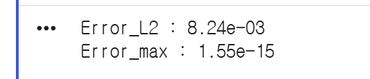
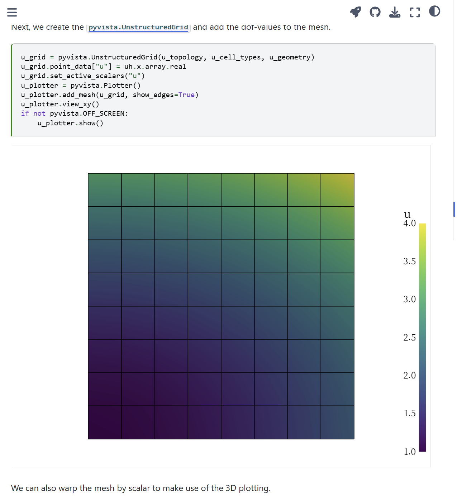
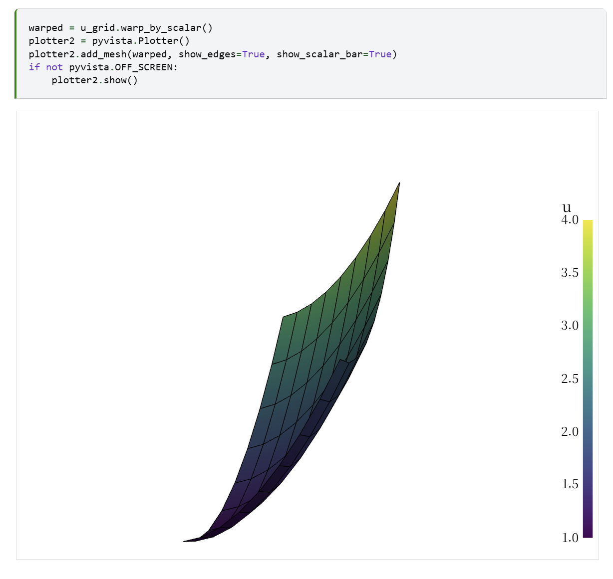
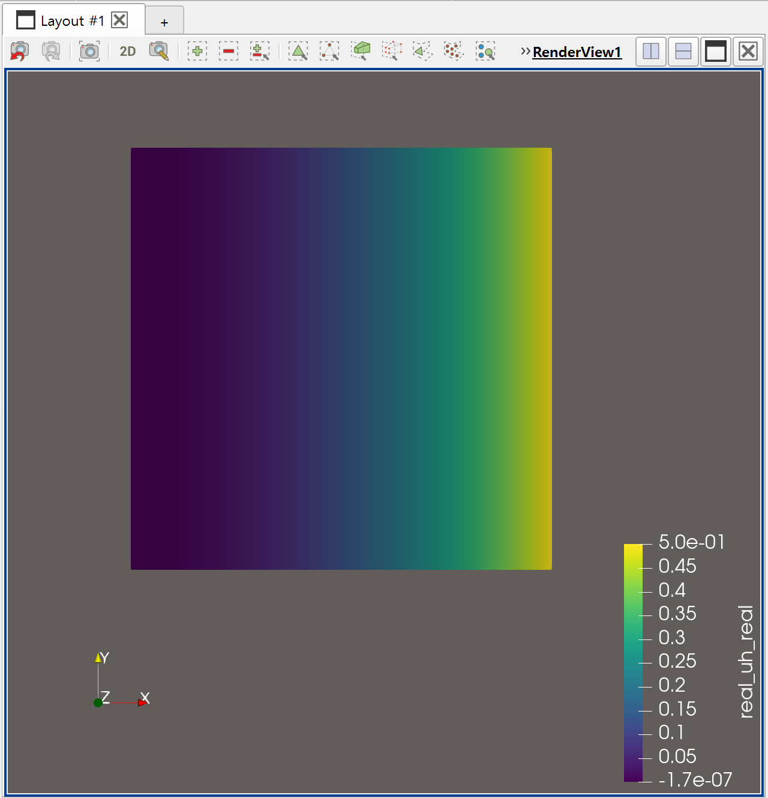
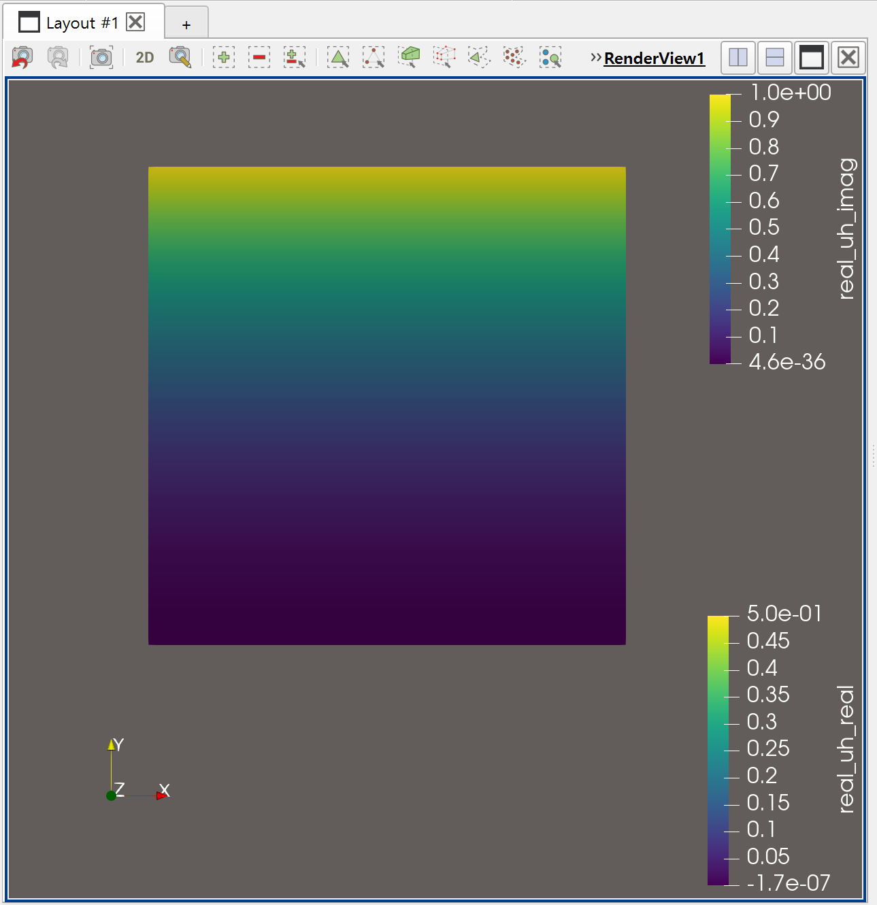
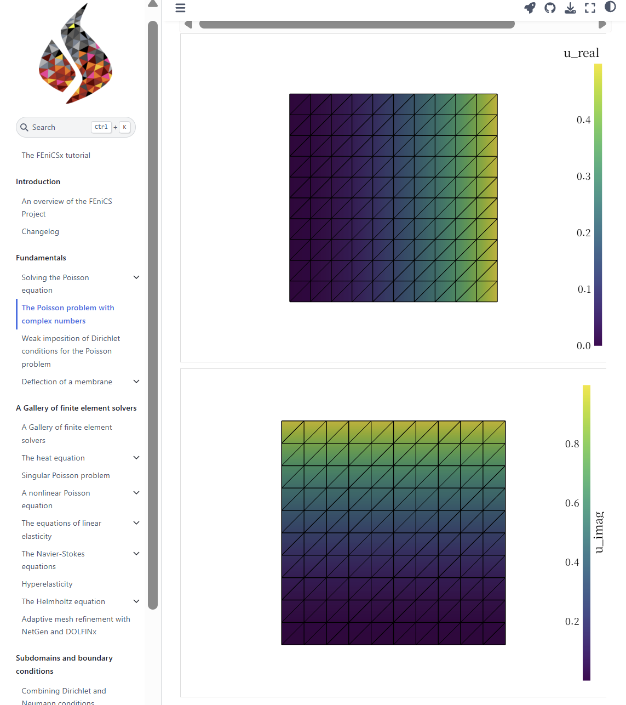

---
# try also 'default' to start simple
theme: seriph
# random image from a curated Unsplash collection by Anthony
# like them? see https://unsplash.com/collections/94734566/slidev
background: ./images/white_background.png
# some information about your slides (markdown enabled)
title: fenics tutorial 1
info: |
  ## Slidev Starter Template
  possion equation

  Learn more at [Sli.dev](https://sli.dev)
# apply UnoCSS classes to the current slide
class: text-center
# https://sli.dev/features/drawing
drawings:
  persist: false
# slide transition: https://sli.dev/guide/animations.html#slide-transitions
transition: none
# enable MDC Syntax: https://sli.dev/features/mdc
mdc: true
# duration of the presentation
duration: 35min
---

# FEniCS Tutorial 1

Poisson equation

<div @click="$slidev.nav.next" class="mt-12 py-1" hover:bg="white op-10">
  Press Space for next page <carbon:arrow-right />
</div>

<div class="abs-br m-6 text-xl">
  <button @click="$slidev.nav.openInEditor()" title="Open in Editor" class="slidev-icon-btn">
    <carbon:edit />
  </button>
  <a href="https://github.com/uzaramen108" target="_blank" class="slidev-icon-btn">
    <carbon:logo-github />
  </a>
  21101565 박기성
</div>

<!--
The last comment block of each slide will be treated as slide notes. It will be visible and editable in Presenter Mode along with the slide. [Read more in the docs](https://sli.dev/guide/syntax.html#notes)
-->
---
# Frontmatter(설정) 부분은 기존 그대로 두게
theme: seriph
class: text-center
highlighter: shiki
---

# Poisson Equation

<div class="text-xl opacity-80 mb-8">
  Poisson 방정식
</div>

<div grid="~ cols-2 gap-8" class="text-left">

<div>

### 1. Governing Equation
Defined by source $f$ and boundary $u_D$

$$
\begin{aligned}
-\nabla^2 u &= f && \text{in } \Omega \\
u &= u_D && \text{on } \partial\Omega
\end{aligned}
$$

<div v-click class="mt-4 text-sm opacity-80">

- $u$ : Unknown Potential (구하려는 미지수)
- $f$ : Prescribed Source

</div>

</div>

<div v-click>

### 2. Verification Strategy (in tutorial)
Prescribe $u$ first, then derive $f$

$$
\begin{aligned}
\text{Step 1:} & \quad \text{Choose } u_e (u_e = 1+x^2+2y^2) \\
\text{Step 2:} & \quad \text{Derive } f = -\nabla^2 u_e \\
\text{Step 3:} & \quad \text{Check } u_{num} \approx u_e
\end{aligned}
$$

</div>
</div>

---
theme: seriph
class: text-center
highlighter: shiki
---

# Poisson Equation

<div class="text-xl opacity-80 mb-8">
  FEniCS에서 Poisson equation 계산
</div>

<div grid="~ cols-2 gap-8" class="text-left">

<div>

### 1. Test function 도입
계산에 사용할 수 있게 다음 변환 과정을 거쳐줍니다.

$$
\begin{aligned}
\int_{\Omega} -(\nabla^2 u) v \, dx = \int_{\Omega} f v \, dx \\
\int_{\Omega} \nabla u \cdot \nabla v \, dx - \int_{\partial\Omega} \frac{\partial u}{\partial n} v \, ds = \int_{\Omega} f v \, dx \\
\int_{\Omega} \nabla u_h \cdot \nabla v \, dx = \int_{\Omega} f v \, dx \quad \forall v \in \hat{V}_h
\end{aligned}
$$

<div v-click class="mt-4 text-sm opacity-80">

- $v$ : Test function (직접 입력)
- 경계에서 상수 조건이기에 (2) 식의 두 번째 항 무시
</div>

</div>

<div v-click>

### 2. Bilinear & linear forms
Prescribe $u$ first, then derive $f$

$$
\begin{aligned}
a(u, v) &= \int_{\Omega} \nabla u \cdot \nabla v \, dx \\
L(v) &= \int_{\Omega} f v \, dx \\
a(u,v) &= L(v)\quad \forall v \in \hat{V}_h
\end{aligned}
$$

</div>
</div>

---
layout: image-right
image: ./images/screenshot2.png
class: bg-black/90 text-white
---

# FEniCS 설치 Code
<div class="overflow-y-auto max-h-[450px] shadow-lg rounded-md border border-gray-200/20">
```python {all} twoslash\
# --------------------------------------------------
# 1️⃣ Mount Google Drive (optional, for cache)
# --------------------------------------------------
from google.colab import drive
import os

if not os.path.ismount("/content/drive"):
    drive.mount("/content/drive")
else:
    print("📦 Google Drive already mounted")

# --------------------------------------------------
# 2️⃣ Clone fenicsx-colab repository (idempotent)
# --------------------------------------------------
from pathlib import Path
import subprocess

REPO_URL = "https://github.com/seoultechpse/fenicsx-colab.git"
ROOT = Path("/content")
REPO_DIR = ROOT / "fenicsx-colab"

def run(cmd):
    subprocess.run(cmd, check=True)

if not REPO_DIR.exists():
    print("📥 Cloning fenicsx-colab...")
    run(["git", "clone", REPO_URL, str(REPO_DIR)])
elif not (REPO_DIR / ".git").exists():
    raise RuntimeError("Directory exists but is not a git repository")
else:
    print("📦 Repository already exists — skipping clone")

# --------------------------------------------------
# 3️⃣ Run setup_fenicsx.py IN THIS KERNEL (CRITICAL)
# --------------------------------------------------
print("🚀 Running setup_fenicsx.py in current kernel")

# ⚙️ Configuration
USE_COMPLEX = False  # <--- Set True ONLY if you need complex PETSc
USE_CLEAN = False    # <--- Set True to remove existing environment

# Build options
opts = []
if USE_COMPLEX:
    opts.append("--complex")
if USE_CLEAN:
    opts.append("--clean")

opts_str = " ".join(opts) if opts else ""

get_ipython().run_line_magic(
    "run", f"{REPO_DIR / 'setup_fenicsx.py'} {opts_str}"
)

# --------------------------------------------------
# 4️⃣ Sanity check
# --------------------------------------------------
try:
    get_ipython().run_cell_magic('fenicsx', '--info -np 4', '')
except Exception as e:
    print("⚠️ %%fenicsx magic not found:", e)
```
</div>

<!-- Footer -->

[Learn more](https://sli.dev/features/line-highlighting)

<!-- Inline style -->
<style>
.footnotes-sep {
  @apply mt-5 opacity-10;
}
.footnotes {
  @apply text-sm opacity-75;
}
.footnote-backref {
  display: none;
}
</style>

<!--
Notes can also sync with clicks

[click] This will be highlighted after the first click

[click] Highlighted with `count = ref(0)`

[click:3] Last click (skip two clicks)
-->

---
layout: image-right
image: ./images/screenshot3.png
class: bg-black/90 text-white
---

# 실행 Code
<div class="overflow-y-auto max-h-[450px] shadow-lg rounded-md border border-gray-200/20">
```python {all} twoslash\
%%fenicsx -np 4
from mpi4py import MPI
from dolfinx import mesh
from dolfinx import fem
from dolfinx import default_scalar_type
from dolfinx.fem.petsc import LinearProblem
import numpy
import ufl

domain = mesh.create_unit_square(MPI.COMM_WORLD, 8, 8, mesh.CellType.quadrilateral)

V = fem.functionspace(domain, ("Lagrange", 1))

uD = fem.Function(V)
uD.interpolate(lambda x: 1 + x[0] ** 2 + 2 * x[1] ** 2)

tdim = domain.topology.dim
fdim = tdim - 1
domain.topology.create_connectivity(fdim, tdim)
boundary_facets = mesh.exterior_facet_indices(domain.topology)

boundary_dofs = fem.locate_dofs_topological(V, fdim, boundary_facets)
bc = fem.dirichletbc(uD, boundary_dofs)


u = ufl.TrialFunction(V)
v = ufl.TestFunction(V)

f = fem.Constant(domain, default_scalar_type(-6))

a = ufl.dot(ufl.grad(u), ufl.grad(v)) * ufl.dx
L = f * v * ufl.dx

problem = LinearProblem(
    a,
    L,
    bcs=[bc],
    petsc_options={"ksp_type": "preonly", "pc_type": "lu"},
    petsc_options_prefix="poisson"
)
uh = problem.solve()

V2 = fem.functionspace(domain, ("Lagrange", 2))
uex = fem.Function(V2, name="u_exact")
uex.interpolate(lambda x: 1 + x[0] ** 2 + 2 * x[1] ** 2)

L2_error = fem.form(ufl.inner(uh - uex, uh - uex) * ufl.dx)
error_local = fem.assemble_scalar(L2_error)
error_L2 = numpy.sqrt(domain.comm.allreduce(error_local, op=MPI.SUM))

error_max = numpy.max(numpy.abs(uD.x.array - uh.x.array))
if domain.comm.rank == 0:
    print(f"Error_L2 : {error_L2:.2e}")
    print(f"Error_max : {error_max:.2e}")

# XDMF/HDF5 파일로 저장 (ParaView 사용)
from dolfinx import io
from pathlib import Path

results_folder = Path("results")
results_folder.mkdir(exist_ok=True, parents=True)
filename = results_folder / "fundamentals"

# XDMF 파일로 저장
with io.XDMFFile(domain.comm, filename.with_suffix(".xdmf"), "w") as xdmf:
    xdmf.write_mesh(domain)
    xdmf.write_function(uh)

if domain.comm.rank == 0:
    print(f"\n✅ Files saved:")
    print(f"   - {filename.with_suffix('.xdmf')}")
    print(f"   - {filename.with_suffix('.h5')}")
    print(f"\n📊 To visualize in ParaView:")
    print(f"   1. Open ParaView")
    print(f"   2. File → Open → {filename.with_suffix('.xdmf')}")
    print(f"   3. Click 'Apply' to load the data")
    print(f"   4. Select 'u' variable to visualize the solution")
```
</div>


[Learn more](https://sli.dev/features/line-highlighting)

<!-- Inline style -->
<style>
.footnotes-sep {
  @apply mt-5 opacity-10;
}
.footnotes {
  @apply text-sm opacity-75;
}
.footnote-backref {
  display: none;
}
</style>

<!--
Notes can also sync with clicks

[click] This will be highlighted after the first click

[click] Highlighted with `count = ref(0)`

[click:3] Last click (skip two clicks)
-->

---
layout: image-right
image: ./images/screenshot4.png
class: bg-black/90 text-white
---

# 실행 Code
<div class="overflow-y-auto max-h-[450px] shadow-lg rounded-md border border-gray-200/20">
```python {all} twoslash\
# 라이브러리 import
%%fenicsx -np 4
from mpi4py import MPI
from dolfinx import mesh
from dolfinx import fem
from dolfinx import default_scalar_type
from dolfinx.fem.petsc import LinearProblem
import numpy
import ufl
```
</div>

[Learn more](https://www.researchgate.net/publication/377241242_DOLFINx_The_next_generation_FEniCS_problem_solving_environment)

<!-- Inline style -->
<style>
.footnotes-sep {
  @apply mt-5 opacity-10;
}
.footnotes {
  @apply text-sm opacity-75;
}
.footnote-backref {
  display: none;
}
</style>

<!--
Notes can also sync with clicks

[click] This will be highlighted after the first click

[click] Highlighted with `count = ref(0)`

[click:3] Last click (skip two clicks)
-->

---
class: bg-black/90 text-white
---

# 실행 Code
<div class="overflow-y-auto max-h-[450px] shadow-lg rounded-md border border-gray-200/20">
```python {all|1-2|4|6-7|9-12|14-15} twoslash\
# mesh 생성 및 기저 설정
domain = mesh.create_unit_square(MPI.COMM_WORLD, 8, 8, mesh.CellType.quadrilateral) # 단위 정사각형 메쉬 생성

V = fem.functionspace(domain, ("Lagrange", 1)) #1차 라그랑주 방정식 기저

uD = fem.Function(V) # 함수공간 V에서 경계조건에 사용할 함수 설정
uD.interpolate(lambda x: 1 + x[0] ** 2 + 2 * x[1] ** 2)

tdim = domain.topology.dim # mesh 차원 할당(2D)
fdim = tdim - 1 # 경계는 1차원
domain.topology.create_connectivity(fdim, tdim) # topology 연결성 생성
boundary_facets = mesh.exterior_facet_indices(domain.topology) # 메쉬의 외부 경계에 있는 모든 면(facet)의 인덱스를 추출

boundary_dofs = fem.locate_dofs_topological(V, fdim, boundary_facets) # 경계에 위치한 자유도(degrees of freedom)를 찾음
bc = fem.dirichletbc(uD, boundary_dofs) # Dirichlet 경계조건 생성
```
</div>

[Learn more](https://www.researchgate.net/publication/377241242_DOLFINx_The_next_generation_FEniCS_problem_solving_environment)

<!-- Inline style -->
<style>
.footnotes-sep {
  @apply mt-5 opacity-10;
}
.footnotes {
  @apply text-sm opacity-75;
}
.footnote-backref {
  display: none;
}
</style>

<!--
Notes can also sync with clicks

[click] This will be highlighted after the first click

[click] Highlighted with `count = ref(0)`

[click:3] Last click (skip two clicks)
-->

---
theme: seriph
class: bg-black/90 text-white
highlighter: shiki
---

# 실행 Code

<div class="text-xl opacity-80 mb-8">
  FEniCS에서 Poisson equation 계산 (Variational Problem)
</div>

<div class="grid grid-cols-2 gap-8 text-left">

<div class="overflow-y-auto h-full shadow-lg rounded-md border border-gray-200/20 bg-[#1e1e1e] p-1">
```python {all|1-3|5|6-8|10-18}
# Main 풀이 영역
u = ufl.TrialFunction(V)
v = ufl.TestFunction(V)

f = fem.Constant(domain, default_scalar_type(-6))

a = ufl.dot(ufl.grad(u), ufl.grad(v)) * ufl.dx
L = f * v * ufl.dx

problem = LinearProblem( # 선형 시스템 Au = b 구성
    a,
    L,
    bcs=[bc], # Dirichlet 경계조건
    petsc_options={"ksp_type": "preonly", "pc_type": "lu"},
    petsc_options_prefix="poisson"
)
uh = problem.solve() # 선형 시스템 풀이
# - Au = b를 풀어서 수치해 uh를 구함
```
</div>
<div class="flex-col justify-center space-y-6">
<div class="text-sm opacity-90 p-4 border-l-4 border-green-500 bg-gray-800/30 rounded-r">
$$
\begin{aligned}
a(u, v) &= \int_{\Omega} \nabla u \cdot \nabla v \, dx \\
L(v) &= \int_{\Omega} f v \, dx \\
a(u,v) &= L(v)\quad \forall v \in \hat{V}_h
\end{aligned}
$$
</div>
<div class="text-sm opacity-90 p-4 border-l-4 border-green-500 bg-gray-800/30 rounded-r">
KSP (Krylov Subspace Solver): PETSc에서 선형 시스템을 푸는 솔버
ksp_type: 어떤 Krylov 방법을 사용할지 지정

PC (Preconditioner, 전처리기): 반복 해법의 수렴 속도를 높이기 위한 기법
pc_type: 어떤 전처리 방법을 사용할지 지정
</div>
</div>
</div>

<div class="abs-br m-6 text-sm opacity-50"> <a href="https://jsdokken.com/dolfinx-tutorial/chapter1/fundamentals_code.html" target="_blank" class="hover:text-blue-400 border-b border-dashed border-gray-500"> Learn more </a> </div>

[Learn more](https://jsdokken.com/dolfinx-tutorial/chapter1/fundamentals_code.html)

---
theme: seriph
class: bg-black/90 text-white
highlighter: shiki
---

# 실행 Code

<div class="text-xl opacity-80 mb-8">
  FEniCS에서 Poisson equation 계산 (Variational Problem)
</div>

<div class="grid grid-cols-2 gap-8 text-left">

<div class="overflow-y-auto shadow-lg rounded-md border border-gray-200/20 bg-[#1e1e1e] p-1">
```python {all|1-4|5-8|10-13}
# Error 분석
V2 = fem.functionspace(domain, ("Lagrange", 2))
uex = fem.Function(V2, name="u_exact")
uex.interpolate(lambda x: 1 + x[0] ** 2 + 2 * x[1] ** 2)

L2_error = fem.form(ufl.inner(uh - uex, uh - uex) * ufl.dx)
error_local = fem.assemble_scalar(L2_error)
error_L2 = numpy.sqrt(domain.comm.allreduce(error_local, op=MPI.SUM))

error_max = numpy.max(numpy.abs(uD.x.array - uh.x.array))
if domain.comm.rank == 0:
    print(f"Error_L2 : {error_L2:.2e}")
    print(f"Error_max : {error_max:.2e}")
```
</div>
<div class="flex-col justify-center space-y-6">
<div class="text-sm opacity-90 p-4 border-l-4 border-green-500 bg-gray-800/30 rounded-r">
Poisson 방정식은 2차 라그랑주로 완벽히 표현 가능
$$
\begin{aligned}
u_e = 1+x^2+2y^2 \\
\end{aligned}
$$
</div>
<div class="text-sm opacity-90 p-4 border-l-4 border-green-500 bg-gray-800/30 rounded-r">
그렇기에 1차 라그랑주로 구한 값(uh)과<br>
2차 라그랑주로 구한 값(uex)의 오차를 분석
</div>
<div v-click class="text-sm opacity-90 p-4 border-l-4 border-green-500 bg-gray-800/30 rounded-r">

</div>
</div>
</div>

<div class="abs-br m-6 text-sm opacity-50"> <a href="https://jsdokken.com/dolfinx-tutorial/chapter1/fundamentals_code.html" target="_blank" class="hover:text-blue-400 border-b border-dashed border-gray-500"> Learn more </a> </div>

[Learn more](https://jsdokken.com/dolfinx-tutorial/chapter1/fundamentals_code.html)

---
theme: seriph
class: bg-black/90 text-white
highlighter: shiki
---

# 실행 Code

<div class="grid grid-cols-2 gap-8 text-left">

<div class="overflow-y-auto shadow-lg rounded-md border border-gray-200/20 bg-[#1e1e1e] p-1">
```python {all}
# XDMF/HDF5 파일로 저장 (ParaView 사용)
from dolfinx import io
from pathlib import Path

results_folder = Path("results")
results_folder.mkdir(exist_ok=True, parents=True)
filename = results_folder / "fundamentals"

# XDMF 파일로 저장
with io.XDMFFile(domain.comm, filename.with_suffix(".xdmf"), "w") as xdmf:
    xdmf.write_mesh(domain)
    xdmf.write_function(uh)

if domain.comm.rank == 0:
    print(f"\n✅ Files saved:")
    print(f"   - {filename.with_suffix('.xdmf')}")
    print(f"   - {filename.with_suffix('.h5')}")
    print(f"\n📊 To visualize in ParaView:")
    print(f"   1. Open ParaView")
    print(f"   2. File → Open → {filename.with_suffix('.xdmf')}")
    print(f"   3. Click 'Apply' to load the data")
    print(f"   4. Select 'u' variable to visualize the solution")
```
</div>
<div class="flex-col justify-center space-y-6">
<div class="text-sm opacity-100 p-4 border-l-4 border-green-500 bg-gray-800/30 rounded-r">


</div>
</div>
</div>

<div class="abs-br m-6 text-sm opacity-50"> <a href="https://jsdokken.com/dolfinx-tutorial/chapter1/fundamentals_code.html" target="_blank" class="hover:text-blue-400 border-b border-dashed border-gray-500"> Learn more </a> </div>

[Learn more](https://jsdokken.com/dolfinx-tutorial/chapter1/fundamentals_code.html)

---
theme: seriph
class: bg-black/90 text-white
highlighter: shiki
---

# Poisson Equation

<div class="grid grid-cols-2 gap-8 text-left">

<div class="flex-col justify-center space-y-6">
<div class="text-sm opacity-100 p-4 border-l-4 border-green-500 bg-gray-800/30 rounded-r">

</div>
</div>
</div>

<div class="abs-br m-6 text-sm opacity-50"> <a href="https://jsdokken.com/dolfinx-tutorial/chapter1/fundamentals_code.html" target="_blank" class="hover:text-blue-400 border-b border-dashed border-gray-500"> Learn more </a> </div>

[Learn more](https://jsdokken.com/dolfinx-tutorial/chapter1/fundamentals_code.html)

---
# Frontmatter
theme: seriph
class: text-center
highlighter: shiki
---

# Poisson Equation (Complex)

<div class="text-xl opacity-80 mb-8">
  Problem with Complex-valued Fields
</div>

<div grid="~ cols-2 gap-8" class="text-left">

<div>

### 1. Governing Equation
Complex source $f$ and boundary $u_D$

$$
\begin{aligned}
-\nabla^2 u &= f && \text{in } \Omega \\
u &= u_D && \text{on } \partial\Omega
\end{aligned}
$$

<div v-click class="mt-4 text-sm opacity-80">

- $u, f$ : Complex-valued functions ($\in \mathbb{C}$)
- $f$ : $-1 - 2j$ (Real: -1, Imag: -2)

</div>

</div>

<div v-click>

### 2. Verification Strategy (in tutorial)
Prescribe complex $u$ first

$$
\begin{aligned}
\text{Step 1:} & \quad u_e = \frac{1}{2}x^2 + 1j \cdot y^2 \\
\text{Step 2:} & \quad f = -\nabla^2 u_e = -(1 + 2j) \\
\text{Step 3:} & \quad \text{Check } u_{num} \approx u_e
\end{aligned}
$$

</div>
</div>

---
theme: seriph
class: text-center
highlighter: shiki
---

# Poisson Equation (Complex)

Inner Product with Conjugate ($\bar{v}$)

<div grid="~ cols-2 gap-8" class="text-left">

<div>

### 1. 1차 미분으로 변환
Inner product for complex spaces

$$
\begin{aligned}
\langle u, v \rangle &= \int_{\Omega} u \cdot \bar{v} \, dx \\
\int_{\Omega} -(\nabla^2 u) \bar{v} \, dx &= \int_{\Omega} f \bar{v} \, dx \\
\int_{\Omega} \nabla u \cdot \nabla \bar{v} \, dx &= \int_{\Omega} f \bar{v} \, dx
\end{aligned}
$$

<div v-click class="mt-4 text-sm opacity-80">

- $\bar{v}$ : Complex Conjugate of Test function
- 내적 정의 시 켤레(Conjugate)가 필수적으로 포함됨
</div>

</div>

<div v-click>

### 2. Bilinear & Linear Forms
Definition for FEniCSx

$$
\begin{aligned}
a(u, v) &= \int_{\Omega} \nabla u \cdot \nabla \bar{v} \, dx \\
L(v) &= \int_{\Omega} f \bar{v} \, dx \\
a(u,v) &= L(v) \quad \forall v \in \hat{V}_h
\end{aligned}
$$

</div>
</div>

---
layout: image-right
image: ./images/screenshot9.png
class: bg-black/90 text-white
---

# 실행 Code
<div class="overflow-y-auto max-h-[450px] shadow-lg rounded-md border border-gray-200/20">
```python {all} twoslash\
%%fenicsx -np 4
from mpi4py import MPI
from dolfinx import mesh
from dolfinx import fem
from dolfinx import default_scalar_type
from dolfinx.fem.petsc import LinearProblem
import numpy as np
import ufl
from pathlib import Path

# Create mesh and function space
domain = mesh.create_unit_square(MPI.COMM_WORLD, 10, 10)
V = fem.functionspace(domain, ("Lagrange", 1))

# Create test functions
u_r = fem.Function(V, dtype=np.float64)
u_r.interpolate(lambda x: x[0])
u_c = fem.Function(V, dtype=np.complex128)
u_c.interpolate(lambda x: 0.5 * x[0] ** 2 + 1j * x[1] ** 2)

tdim = domain.topology.dim
fdim = tdim - 1

print("u_r dtype:", u_r.x.array.dtype)
print("u_c dtype:", u_c.x.array.dtype)

# PETSc setup
from petsc4py import PETSc
from dolfinx.fem.petsc import assemble_vector

print("PETSc.ScalarType:", PETSc.ScalarType)
assert np.dtype(PETSc.ScalarType).kind == "c", "PETSc must be compiled with complex support"

# Variational formulation
u = ufl.TrialFunction(V)
v = ufl.TestFunction(V)
f = fem.Constant(domain, PETSc.ScalarType(-1 - 2j))

a = ufl.inner(ufl.grad(u), ufl.grad(v)) * ufl.dx
L = ufl.inner(f, v) * ufl.dx
L2 = f * ufl.conj(v) * ufl.dx

print("L  =", L)
print("L2 =", L2)

# Test derivative
J = u_c**2 * ufl.dx
F = ufl.derivative(J, u_c, ufl.conj(v))
residual = assemble_vector(fem.form(F))
print("Residual:", residual.array)

# Boundary conditions
domain.topology.create_connectivity(fdim, tdim)
boundary_facets = mesh.exterior_facet_indices(domain.topology)
boundary_dofs = fem.locate_dofs_topological(
    V, fdim, boundary_facets
)
bc = fem.dirichletbc(u_c, boundary_dofs)

# Solve the problem
problem = fem.petsc.LinearProblem(
    a, L, bcs=[bc], petsc_options_prefix="complex_poisson"
)
uh = problem.solve()

# Compute error
x = ufl.SpatialCoordinate(domain)
u_ex = 0.5 * x[0] ** 2 + 1j * x[1] ** 2
L2_error = fem.form(
    ufl.dot(uh - u_ex, uh - u_ex) * ufl.dx(metadata={"quadrature_degree": 5})
)
local_error = fem.assemble_scalar(L2_error)
global_error = np.sqrt(domain.comm.allreduce(local_error, op=MPI.SUM))
max_error = domain.comm.allreduce(np.max(np.abs(u_c.x.array - uh.x.array)), op=MPI.MAX)

print(f"L2 Error: {global_error}")
print(f"Max Error: {max_error}")

# --------------------------------------------------
# Export to HDF5/XDMF for Paraview
# --------------------------------------------------
from dolfinx.io import XDMFFile

# Create output directory
output_dir = Path("complex_poisson_output")
output_dir.mkdir(exist_ok=True)

# We need to split complex function into real and imaginary parts
# because Paraview doesn't natively support complex fields

V_real = fem.functionspace(domain, ("Lagrange", 1))
uh_real = fem.Function(V_real, name="uh_real")
uh_imag = fem.Function(V_real, name="uh_imag")

# Copy real and imaginary parts
uh_real.x.array[:] = uh.x.array.real
uh_imag.x.array[:] = uh.x.array.imag

# Export real part
with XDMFFile(domain.comm, output_dir / "uh_real.xdmf", "w") as xdmf:
    xdmf.write_mesh(domain)
    xdmf.write_function(uh_real)

# Export imaginary part
with XDMFFile(domain.comm, output_dir / "uh_imag.xdmf", "w") as xdmf:
    xdmf.write_mesh(domain)
    xdmf.write_function(uh_imag)

if domain.comm.rank == 0:
    print(f"\n✅ XDMF files exported to {output_dir}/")
    print(f"   - uh_real.xdmf")
    print(f"   - uh_imag.xdmf")
    print(f"\nOpen these files in Paraview to visualize the solution.")
```
</div>


[Learn more](https://sli.dev/features/line-highlighting)

<!-- Inline style -->
<style>
.footnotes-sep {
  @apply mt-5 opacity-10;
}
.footnotes {
  @apply text-sm opacity-75;
}
.footnote-backref {
  display: none;
}
</style>

<!--
Notes can also sync with clicks

[click] This will be highlighted after the first click

[click] Highlighted with `count = ref(0)`

[click:3] Last click (skip two clicks)
-->

---
layout: image-right
image: ./images/screenshot9.png
class: bg-black/90 text-white
---

# 실행 Code
<div class="overflow-y-auto max-h-[450px] shadow-lg rounded-md border border-gray-200/20">
```python {all|1-10|11-14|16-20|22-23} twoslash\
# 라이브러리 import 및 mesh 설정
%%fenicsx -np 4
from mpi4py import MPI
from dolfinx import mesh
from dolfinx import fem
from dolfinx import default_scalar_type
from dolfinx.fem.petsc import LinearProblem
import numpy as np
import ufl
from pathlib import Path

# Create mesh and function space
domain = mesh.create_unit_square(MPI.COMM_WORLD, 10, 10) # mesh.CellType.quadrilateral 빠짐
V = fem.functionspace(domain, ("Lagrange", 1))

# Create test functions(실수 따로 허수 따로)
u_r = fem.Function(V, dtype=np.float64)
u_r.interpolate(lambda x: x[0])
u_c = fem.Function(V, dtype=np.complex128)
u_c.interpolate(lambda x: 0.5 * x[0] ** 2 + 1j * x[1] ** 2)

tdim = domain.topology.dim
fdim = tdim - 1
```
</div>

[Learn more](https://www.researchgate.net/publication/377241242_DOLFINx_The_next_generation_FEniCS_problem_solving_environment)

<!-- Inline style -->
<style>
.footnotes-sep {
  @apply mt-5 opacity-10;
}
.footnotes {
  @apply text-sm opacity-75;
}
.footnote-backref {
  display: none;
}
</style>

<!--
Notes can also sync with clicks

[click] This will be highlighted after the first click

[click] Highlighted with `count = ref(0)`

[click:3] Last click (skip two clicks)
-->

---
theme: seriph
class: bg-black/90 text-white
highlighter: shiki
---

# 실행 Code

<div class="text-xl opacity-80 mb-8">
  FEniCS에서 Poisson equation 계산 (Variational Problem)
</div>

<div class="grid grid-cols-2 gap-8 text-left">

<div class="overflow-y-auto h-full shadow-lg rounded-md border border-gray-200/20 bg-[#1e1e1e] p-1">
```python {all|1-3|5-6|8-11|12-15}
# PETSc setup
from petsc4py import PETSc
from dolfinx.fem.petsc import assemble_vector

print("PETSc.ScalarType:", PETSc.ScalarType)
assert np.dtype(PETSc.ScalarType).kind == "c", "PETSc must be compiled with complex support"

# Variational formulation
u = ufl.TrialFunction(V)
v = ufl.TestFunction(V)
f = fem.Constant(domain, PETSc.ScalarType(-1 - 2j))

a = ufl.inner(ufl.grad(u), ufl.grad(v)) * ufl.dx
L = ufl.inner(f, v) * ufl.dx
L2 = f * ufl.conj(v) * ufl.dx
```
</div>
<div class="flex-col justify-center space-y-6">
<div class="text-sm opacity-90 p-4 border-l-4 border-green-500 bg-gray-800/30 rounded-r">
$$
\begin{aligned}
a(u, v) &= \int_{\Omega} \nabla u \cdot \nabla \bar{v} \, dx \\
L(v) &= \int_{\Omega} f \bar{v} \, dx \\
a(u,v) &= L(v)\quad \forall v \in \hat{V}_h
\end{aligned}
$$
</div>
</div>
</div>

<div class="abs-br m-6 text-sm opacity-50"> <a href="https://jsdokken.com/dolfinx-tutorial/chapter1/fundamentals_code.html" target="_blank" class="hover:text-blue-400 border-b border-dashed border-gray-500"> Learn more </a> </div>

[Learn more](https://jsdokken.com/dolfinx-tutorial/chapter1/fundamentals_code.html)

---
class: bg-black/90 text-white
---

# 실행 Code
<div class="grid grid-cols-2 gap-8 text-left">
<div class="overflow-y-auto max-h-[450px] shadow-lg rounded-md border border-gray-200/20">
```python {all|1-5|6-13} twoslash\
# Test derivative
J = u_c**2 * ufl.dx
F = ufl.derivative(J, u_c, ufl.conj(v))
residual = assemble_vector(fem.form(F))
print("Residual:", residual.array)

# Boundary conditions
domain.topology.create_connectivity(fdim, tdim)
boundary_facets = mesh.exterior_facet_indices(domain.topology)
boundary_dofs = fem.locate_dofs_topological(
    V, fdim, boundary_facets
)
bc = fem.dirichletbc(u_c, boundary_dofs)
```
</div>
<div class="flex-col justify-center space-y-6">
<div class="text-sm opacity-90 p-4 border-l-4 border-green-500 bg-gray-800/30 rounded-r">
$$
\begin{aligned}
J(u_c) &= \int_{\Omega} u_c^2 \, dx \\
F(v) &= \delta J(u_c; \bar{v}) \\
&= \frac{d}{d\epsilon} J(u_c + \epsilon \bar{v}) \Big|_{\epsilon=0} \\
&= \int_{\Omega} 2 u_c \cdot \bar{v} \, dx
\end{aligned}
$$
<div class="mt-2 text-xs text-gray-400">
* FEniCS가 복소수의 미분에도 정상작동하는가?
</div>
</div>
</div>
</div>

[Learn more](https://www.researchgate.net/publication/377241242_DOLFINx_The_next_generation_FEniCS_problem_solving_environment)

<!-- Inline style -->
<style>
.footnotes-sep {
  @apply mt-5 opacity-10;
}
.footnotes {
  @apply text-sm opacity-75;
}
.footnote-backref {
  display: none;
}
</style>

<!--
Notes can also sync with clicks

[click] This will be highlighted after the first click

[click] Highlighted with `count = ref(0)`

[click:3] Last click (skip two clicks)
-->

---
class: bg-black/90 text-white
---

# 실행 Code
<div class="grid grid-cols-2 gap-8 text-left">
<div class="overflow-y-auto max-h-[450px] shadow-lg rounded-md border border-gray-200/20">
```python {all|1-8|10-18|20-21} twoslash\
# Solve the problem
problem = fem.petsc.LinearProblem(
    a,
    L,
    bcs=[bc],
    petsc_options_prefix="complex_poisson"
)
uh = problem.solve()

# Compute error
x = ufl.SpatialCoordinate(domain)
u_ex = 0.5 * x[0] ** 2 + 1j * x[1] ** 2 # 해석해: 0.5x² + i·y²
L2_error = fem.form(
    ufl.dot(uh - u_ex, uh - u_ex) * ufl.dx(metadata={"quadrature_degree": 5})
)
local_error = fem.assemble_scalar(L2_error) # 로컬 프로세스 오차
global_error = np.sqrt(domain.comm.allreduce(local_error, op=MPI.SUM)) # 전체 오차
max_error = domain.comm.allreduce(np.max(np.abs(u_c.x.array - uh.x.array)), op=MPI.MAX)

print(f"L2 Error: {global_error}")
print(f"Max Error: {max_error}")
```
</div>
<div v-click class="flex flex-col gap-4 items-center py-2">
  <div class="text-center w-full">
    
  </div>
</div>
</div>

<!-- Inline style -->
<style>
.footnotes-sep {
  @apply mt-5 opacity-10;
}
.footnotes {
  @apply text-sm opacity-75;
}
.footnote-backref {
  display: none;
}
</style>

<!--
Notes can also sync with clicks

[click] This will be highlighted after the first click

[click] Highlighted with `count = ref(0)`

[click:3] Last click (skip two clicks)
-->

---
class: bg-black/90 text-white
---

# 실행 Code
<div class="grid grid-cols-2 gap-8 text-left">
<div class="overflow-y-auto max-h-[450px] shadow-lg rounded-md border border-gray-200/20">
```python {all} twoslash\
from dolfinx.io import XDMFFile

# Create output directory
output_dir = Path("complex_poisson_output")
output_dir.mkdir(exist_ok=True)

# We need to split complex function into real and imaginary parts
# because Paraview doesn't natively support complex fields

V_real = fem.functionspace(domain, ("Lagrange", 1))
uh_real = fem.Function(V_real, name="uh_real")
uh_imag = fem.Function(V_real, name="uh_imag")

# Copy real and imaginary parts
uh_real.x.array[:] = uh.x.array.real
uh_imag.x.array[:] = uh.x.array.imag

# Export real part
with XDMFFile(domain.comm, output_dir / "uh_real.xdmf", "w") as xdmf:
    xdmf.write_mesh(domain)
    xdmf.write_function(uh_real)

# Export imaginary part
with XDMFFile(domain.comm, output_dir / "uh_imag.xdmf", "w") as xdmf:
    xdmf.write_mesh(domain)
    xdmf.write_function(uh_imag)

if domain.comm.rank == 0:
    print(f"\n✅ XDMF files exported to {output_dir}/")
    print(f"   - uh_real.xdmf")
    print(f"   - uh_imag.xdmf")
    print(f"\nOpen these files in Paraview to visualize the solution.")
```
</div>
<div class="flex-col justify-center space-y-6">
<div class="text-sm opacity-100 p-4 border-l-4 border-green-500 bg-gray-800/30 rounded-r">
<div v-click class="flex flex-col gap-4 items-center py-2">
  <div class="text-center w-full">
    
  </div>

  <div class="text-center w-full">
    
  </div>
</div>

</div>
</div>
</div>

[Learn more](https://www.researchgate.net/publication/377241242_DOLFINx_The_next_generation_FEniCS_problem_solving_environment)

<!-- Inline style -->
<style>
.footnotes-sep {
  @apply mt-5 opacity-10;
}
.footnotes {
  @apply text-sm opacity-75;
}
.footnote-backref {
  display: none;
}
</style>

<!--
Notes can also sync with clicks

[click] This will be highlighted after the first click

[click] Highlighted with `count = ref(0)`

[click:3] Last click (skip two clicks)
-->

---
layout: center
class: text-center
---

# Thank you for listening
### 발표를 들어주셔서 감사합니다.

[Colab Scripts](https://github.com/uzaramen108) · [GitHub](https://github.com/uzaramen108) · [Showcases](https://sli.dev/resources/showcases)

<PoweredBySlidev mt-10 />
