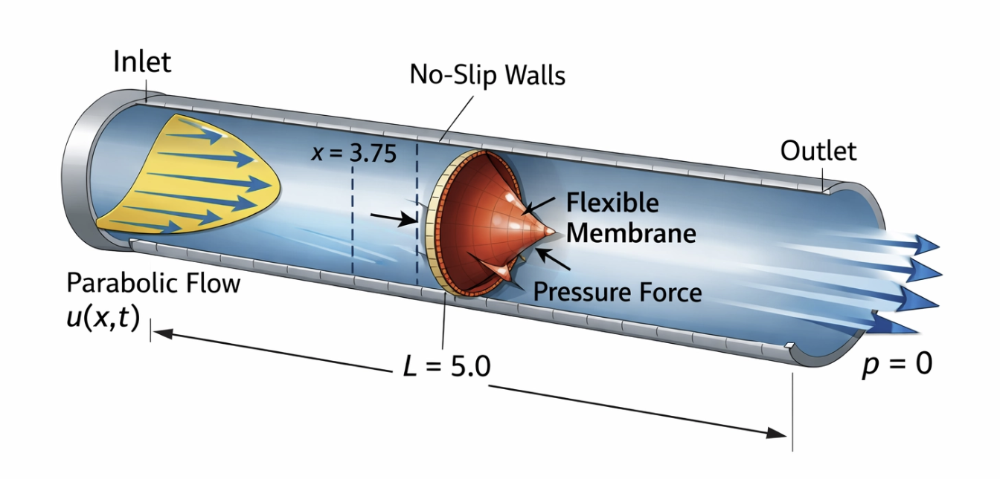
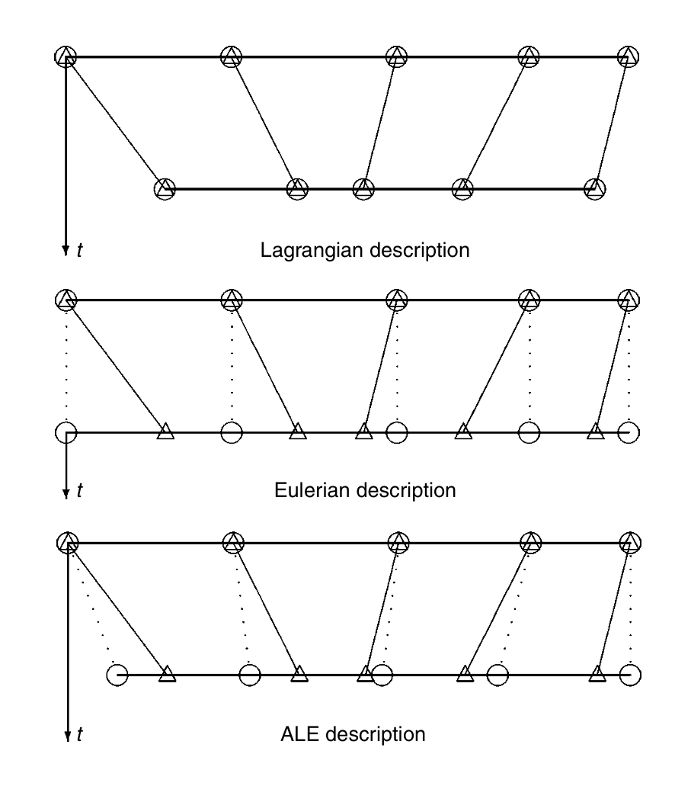
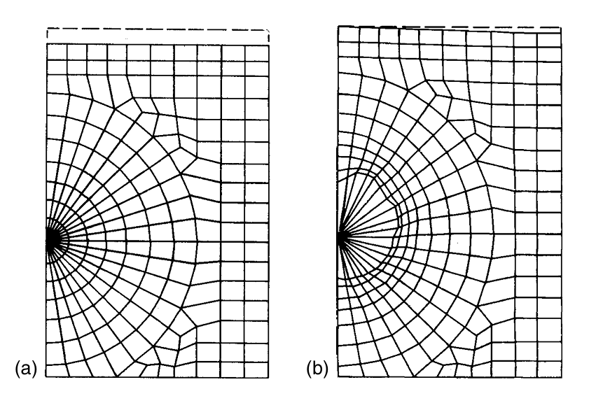
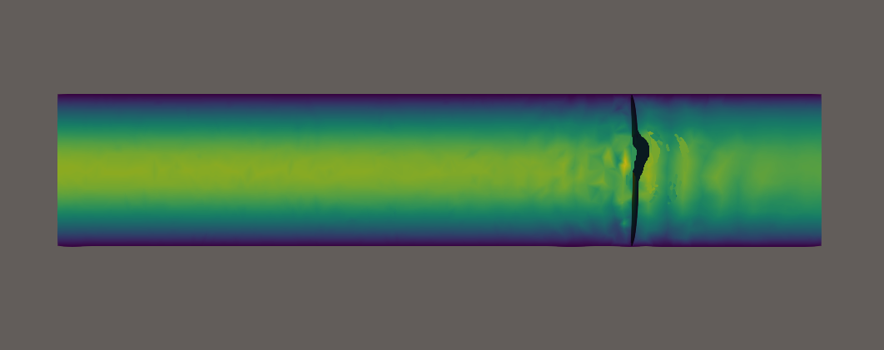

<div class="absolute inset-0 bg-white z-0" />


<div class="relative z-10 flex flex-col items-center justify-center h-full" color='black'>

# Obstacle Problem의 Developing 과정


<div class="text-xl opacity-80 mb-8 mt-4">
  Navier-Stokes, Brinkman, Darcy, ALE
</div>

</div>

<div class="absolute bottom-6 right-6 text-xl z-10" color='black'>
  Team FEniCS: 이민용 / 박기성 / 박찬서 / 윤현준
</div>

---
theme: seriph
class: text-center
highlighter: shiki
---

# 1. Develop하려는 문제 상황(응용1)

<div class="text-xl opacity-80 mb-6">반투막이 있는 원형 관로에서의 유체 거동</div>

<div grid="~ cols-2 gap-8" class="text-left">

<div v-click>

### 🔹 물리적 설정

원형 단면의 3D 파이프 내부를 유체가 흐르다가 중간에 위치한
반투막(semi-permeable membrane)과 만나는 문제입니다.

<br>

<div class="-mt-4 text-xs opacity-80 bg-[rgb(210,220,220)] rounded-md px-2 py-1 leading-tight">

<style scoped>
table { 
  margin: 0 !important;
  width: 100%;
}
th, td { 
  padding: 1px 6px !important; /* 상하 패딩을 1px로 극한까지 줄임 */
  line-height: 1.1 !important;
  border-bottom-width: 1px !important;
}
</style>

| 파라미터 | 값 | 단위 |
|---|---|---|
| 파이프 길이 $L$ | 5.0 | m |
| 파이프 반지름 $R$ | 0.5 | m |
| 막 위치 $x_m$ | 3.75 | m |
| 유체 밀도 $\rho$ | 1.0 | kg/m³ |
| 유체 점성 $\mu$ | 0.01 | Pa·s |
| 막 투과율 $\kappa$ | 5×10⁻³ | m² |
| 막 장력 $T$ | 25 | N/m |

</div>

</div>

<div v-click>

### 🔹 입구 조건

포물선 프로파일 + 사인파 시간 변화

$$u_{inlet}(r,t) = u_{max} \sin\!\left(\frac{\pi t}{2T}\right)\left(1 - \frac{r^2}{R^2}\right)$$

### 🔹 계산 목표

<div class="mt-2 text-sm opacity-80">

- **속도장** $u(x,t)$: 막 전후 유체의 흐름 패턴
- **압력장** $p(x,t)$: 막 전후 압력 분포 및 점프
- **막 변위** $w(x,t)$: 압력 하중에 의한 막의 휨

</div>

<div class="w-full flex justify-center -mt-3">
  
</div>

</div>
</div>

---
layout: center
class: text-center
---

# The PDE Problem: Navier-Stokes
<div class="text-xl opacity-80 mb-8">
  비압축성 유체의 지배 방정식
</div>

<div grid="~ cols-2 gap-8" class="text-left mt-8">

<div>

### 1. Momentum & Continuity
유체의 운동량 보존과 비압축성을 나타냅니다.

$$
\rho \left( \frac{\partial u}{\partial t} + u \cdot \nabla u \right) = \nabla \cdot \sigma(u, p) + f
$$
$$
\nabla \cdot u = 0
$$
- $u$: 속도 (Velocity)
- $p$: 압력 (Pressure)
- $f$: 외력 (Body force)

</div>

<div v-click>

### 2. Stress Tensor
뉴턴 유체의 응력 텐서를 정의합니다.

$$
\sigma(u, p) = 2\mu\epsilon(u) - pI
$$
$$
\epsilon(u) = \frac{1}{2}(\nabla u + (\nabla u)^T)
$$
- $2\mu\epsilon$: 유체의 변형에 의한 점성 마찰력
- $-pI$: 압력에 의한 수직 응력

</div>
</div>

---
layout: center
---

# Step 1: 임시 속도 $u^*$ 구하기 (1/3)
<div class="text-xl opacity-80 mb-8">기본 지배 방정식과 시간 이산화</div>

<div class="text-sm mt-8">

### 1. 원래의 운동량 보존 방정식 (강형, Strong Form)
가장 기본이 되는 나비에-스토크스 방정식입니다.
$$ \rho \frac{\partial u}{\partial t} + \rho (u \cdot \nabla u) = \nabla \cdot (2\mu\epsilon(u)) - \nabla p + f $$

<br>

### 2. 시간 이산화 (Time Discretization)
컴퓨터가 계산할 수 있도록 시간 미분 $\frac{\partial u}{\partial t}$를 $\frac{u^* - u^n}{\Delta t}$ (코드의 `(u - u_n) / k`)로 쪼갭니다.
이때, 점성항에는 현재와 과거의 평균을 쓰는 **Crank-Nicolson (CN) 기법**을 적용하여 수치적 안정성을 높입니다.
$$ \rho \frac{u^* - u^n}{\Delta t} + \rho (u \cdot \nabla u) - \nabla \cdot \left(2\mu\epsilon\left(\frac{u^* + u^n}{2}\right)\right) + \nabla p^n = f $$

</div>

---
layout: center
---

# Step 1: 임시 속도 $u^*$ 구하기 (2/3)
<div class="text-xl opacity-80 mb-8">대류항 선형화 및 부분 적분(약형 변환)</div>

<div class="text-sm mt-8">

### 3. 대류항의 선형화 (Linearization of Convection)
비선형항인 $u \cdot \nabla u$를 해결해야 합니다. 속도 벡터 두 개가 곱해져 있어 방정식이 안 풀리므로, 앞의 $u$는 과거 데이터를 이용해 추정치(외삽)를 만들고, 뒤의 $\nabla u$는 미분항에 CN 기법을 씁니다.
* **앞부분 (Adams-Bashforth 외삽)**: $u_{AB} = \frac{3}{2}u^n - \frac{1}{2}u^{n-1}$
* **뒷부분 (Crank-Nicolson 미분)**: $\nabla u_{CN} = \nabla\left(\frac{u^* + u^n}{2}\right)$

<br>

### 4. 부분 적분 (Integration by Parts)
양변에 테스트 함수 $v$를 곱하고 전체 영역에 대해 적분합니다. 이때 2계 미분인 점성항과 1계 미분인 압력항의 미분 차수를 낮춰줍니다.
* **점성항 변환**: $\int -\nabla \cdot (2\mu\epsilon) \cdot v \Rightarrow \int \mu \nabla u : \nabla v$
* **압력항 변환**: $\int \nabla p \cdot v \Rightarrow \int -p (\nabla \cdot v)$

</div>

---
layout: two-cols
layoutClass: gap-8
---

# Step 1: 임시 속도 $u^*$ 구하기 (3/3)
<div class="text-xl opacity-80 mb-8">최종 수식과 코드 매칭</div>

::left::

<div class="text-[13px] mt-4">

### 5. 최종 수식 ($F_1 = 0$)
앞선 시간 이산화, 선형화, 약형 변환을 모두 합치면 코드와 완벽히 일치하는 최종 잔차(Residual) 방정식이 됩니다.

$$
\begin{aligned}
F_1 &= \int \rho \frac{u^* - u^n}{\Delta t} \cdot v
&+ \int \rho (u_{AB} \cdot \nabla u_{CN}) \cdot v
&+ \int \mu \nabla u_{CN} : \nabla v
\end{aligned}
$$
$$
\begin{aligned}
&- \int p^n (\nabla \cdot v)
&+ \int f \cdot v = 0
\end{aligned}
$$

(여기서 $u^*$는 미지수 $u$를 의미합니다.)

</div>

::right::

<div class="overflow-y-auto max-h-[450px] shadow-lg rounded-md border border-gray-200/20 text-sm mt-12">

```python {all} twoslash
# Step 1: Tentative velocity step (u_s)

# 1. 시간 미분항
F1 = rho / k * dot(u - u_n, v) * dx

# 2. 대류항 (Adams-Bashforth + Crank-Nicolson)
F1 += inner(dot(1.5 * u_n - 0.5 * u_n1, 
                0.5 * nabla_grad(u + u_n)), v) * dx

# 3. 점성항 (부분적분 완료, CN 적용)
# 4. 압력항 (부분적분 완료, 이전 스텝 p_ 사용)
F1 += 0.5 * mu * inner(grad(u + u_n), grad(v)) * dx \
      - dot(p_, div(v)) * dx

# 5. 외력항 (f = 0)
F1 += dot(f, v) * dx

a1 = form(lhs(F1))
L1 = form(rhs(F1))
```
</div>

---
theme: seriph
class: text-center
highlighter: shiki
---

# 2-1. 약형 도출


<div grid="~ cols-2 gap-8" class="text-left text-sm">

<div class="text-[13px] mt-4" v-click>

### 1. 수식 변환 과정
진짜 속도와 가짜 속도의 차이는 "새롭게 업데이트될 압력의 구배(기울기)" 때문에 발생합니다.
$$ \rho \frac{u^{n+1} - u^*}{\Delta t} = -\nabla (p^{n+1} - p^n) $$

양변에 발산($\nabla \cdot$)을 취하고, $\nabla \cdot u^{n+1} = 0$을 대입하면 **poisson equation** 형태가 됩니다. (여기서 $\phi = p^{n+1} - p^n$ 이라 둡니다).
$$ \nabla^2 \phi = \frac{\rho}{\Delta t} \nabla \cdot u^* $$

### 2. 약형 (Weak Form) 변환
테스트 함수 $q$를 곱하고 좌변에 부분 적분을 적용합니다.
$$ \int \nabla \phi \cdot \nabla q = -\int \frac{\rho}{\Delta t} (\nabla \cdot u^*) q $$

</div>

<div class="text-[13px] mt-4" v-click>

### 1. 속도 보정 수식 (Velocity Projection)
Step 2에서 구한 식을 다시 $u^{n+1}$에 대해 정리합니다.
$$ u^{n+1} = u^* - \frac{\Delta t}{\rho} \nabla \phi $$

### 2. 약형 (Weak Form) 변환
전체 식에 밀도 $\rho$와 테스트 함수 $v$를 곱하여 적분형(질량 행렬 형태)으로 만듭니다.
$$ \int \rho u^{n+1} \cdot v = \int \rho u^* \cdot v - \int \Delta t \nabla \phi \cdot v $$

- 좌변: 구하려는 진짜 속도 $u^{n+1}$ (코드의 `u`)
- 우변 첫 번째: 이미 구한 가짜 속도 $u^*$ (코드의 `u_s`)
- 우변 두 번째: 이미 구한 압력 증분의 구배 $\nabla \phi$

이 단계를 통과한 $u^{n+1}$은 완벽하게 비압축성 조건을 만족하게 됩니다.

</div>
</div>

---
theme: seriph
class: text-center
highlighter: shiki
---

# 2-2. 약형 적용 및 차수 할당

<br>

<div grid="~ cols-2 gap-8" class="text-left text-sm">

<div v-click>

### 🔹 Step 3: 속도 보정

$$\int_\Omega \rho\, u^{n+1}\cdot v = \int_\Omega \rho\, u^*\cdot v - \int_\Omega \Delta t\,\nabla\phi\cdot v$$

이 단계를 거친 $u^{n+1}$은 **$\nabla\cdot u = 0$을 정확히 만족**합니다.

$$p^{n+1} = p^n + \phi$$

```python
# NS Step 3: velocity correction
a3_ufl = form(rho_v * dot(u_t, vf) * dxf)
L3_ufl = form(rho_v * dot(u_, vf) * dxf
            - dt * dot(nabla_grad(p_ - p_n), vf) * dxf)
```

</div>

<div v-click>

### 🔹 함수 공간: Taylor-Hood P2/P1

속도-압력 쌍은 **inf-sup 조건(LBB)** 을 만족해야 발진하지 않습니다.

-비압축성 유체 계산에서 속도($u$)와 압력($p$)에 똑같은 차수의 함수(예: 둘 다 P1)를 사용하면, 계산 결과에서 압력이 마치 체스판 무늬처럼 위아래로 진동(Oscillation)이 일어남.

<div style="background-color:rgb(220,220,210)">

| 변수 | 차수 | 이유 |
|---|---|---|
| 속도 $u$ | P2 | inf-sup 조건(압력보다 큰 차수) |
| 압력 $p$ | P1 |  |

</div>
</div>
</div>

---
theme: seriph
class: text-center
highlighter: shiki
---

# 3-1. 메시 설정: 파이프 단독 구조

<div class="text-xl opacity-80 mb-6">Brinkman 방식 — 분리된 2개 메시</div>

<div grid="~ cols-2 gap-8" class="text-left text-sm">

<div v-click>

### 🔹 메시 구성 (초기)
```python
# 유체 메시: 3D 원기둥
cylinder = gmsh.model.occ.addCylinder(
    0, 0, 0, L, 0, 0, R)

# 막 메시: 별도 2D 디스크
disk = gmsh.model.occ.addDisk(0, 0, 0, R, R)
gmsh.model.occ.rotate(...)
gmsh.model.occ.translate(..., mem_pos, 0, 0)
```

두 메시가 **완전히 분리**되어 있습니다.

</div>

<div v-click>

### 🔹 분리된 메시의 문제점
```
fluid_mesh ──┐
              ├── 서로 다른 메시
mem_mesh   ──┘

```

→ 내부 경계면 공유 불가<br>
→ dS 표면 적분 불가<br>
→ FacetNormal을 dx 안에 사용 시 오류<br>
→ KDTree 매핑 필요
</div>

</div>

---
theme: seriph
class: text-center
highlighter: shiki
---

# 3-2. 메시 설정: 파이프 단독 구조

<div class="text-xl opacity-80 mb-6">Brinkman 방식 — 분리된 2개 메시</div>

<div grid="~ cols-2 gap-8" class="text-left text-sm">

<div v-click>

### 🔹 경계 조건

**유체:**
- 입구: Poiseuille 속도 프로파일
- 출구: 압력 $p = 0$
- 벽면: No-slip ($u = 0$)

**막:**
- 테두리: 고정단 ($w = 0$)

</div>

<div v-click>


### 🔹 압력-막 연결 (KDTree 매핑)
```python
# 유체 압력 DOF 좌표
q_coords = Q_f.tabulate_dof_coordinates()
# 막 DOF 좌표
w_coords = W_m.tabulate_dof_coordinates()

# 최근접 매핑
tree = cKDTree(q_coords)
_, W_to_Qf = tree.query(w_coords)
```

</div>
</div>

---
theme: seriph
class: text-center
highlighter: shiki
---

# 3-3. 메시 설정: Fragment 통합 구조

<div class="text-xl opacity-80 mb-6">Darcy + ALE 방식 — 내부 경계면으로 통합</div>

<div grid="~ cols-2 gap-8" class="text-left text-sm">

<div v-click>

### 🔹 Gmsh Fragment 연산

파이프를 막 위치에서 **두 조각으로 나누고** 막 디스크가 공유 경계면이 되도록 합니다:
```python
    c1 = gmsh.model.occ.addCylinder(0,   0, 0, x_m,     0, 0, R)
    c2 = gmsh.model.occ.addCylinder(x_m, 0, 0, L - x_m, 0, 0, R)
    dk = gmsh.model.occ.addDisk(x_m, 0, 0, R, R)
    gmsh.model.occ.rotate([(2, dk)], x_m, 0, 0, 0, 1, 0, np.pi / 2)
    out_tags, out_map = gmsh.model.occ.fragment(
        [(3, c1), (3, c2)], [(2, dk)]
    )
```
<div class="mt-4 text-xs opacity-80 bg-[rgb(200,200,240)] rounded-md px-2 py-1 leading-tight">

<style scoped>
table { 
  margin: 0 !important;
  width: 100%;
}
th, td { 
  padding: 6px 6px !important; /* 상하 패딩을 1px로 극한까지 줄임 */
  line-height: 1.4 !important;
  border-bottom-width: 2px !important;
}
</style>

| Physical Group | fluid (vol) | inlet | outlet | membrane |
| :--- | :--- | :--- | :--- | :--- |
| **역할** | 3D 유체 도메인 | 입구 경계 | 출구 경계 | **내부 경계면** |
</div>
</div>

<div v-click>

### 🔹 Fragment 후의 장점
```
기존:                     Fragment 후:
두 개 메시               하나의 통합 메시
KDTree 매핑              geom_map으로 정확한 인덱스
dS 불가                  dS_m (tag=4) 직접 적분 가능
FacetNormal 오류         FacetNormal 사용 가능
```

### 🔹 2D Submesh 추출

막 계산을 위한 2D submesh를 3D 메시에서 추출합니다:
```python
sub_m, emap_m, vmap_m, geom_map_raw = create_submesh(
    msh, msh.topology.dim - 1, ft.find(4)
)
geom_map = np.array(geom_map_raw, dtype=np.int32)

# 동기화: sub_m.geometry.x[i] = msh.geometry.x[geom_map[i]]
# → 매 스텝 msh가 이동하면 sub_m도 함께 갱신
```

</div>
</div>

---
theme: seriph
class: text-center
highlighter: shiki
---

# 4. Brinkman 방정식 적용 시도

<div class="text-xl opacity-80 mb-6">압력 분포 및 물리적 타당성</div>

<div grid="~ cols-2 gap-8" class="text-left text-sm">

<div v-click>

### 🔹 Brinkman 방정식

NS에 **부피 저항항** $\frac{\mu}{\kappa}u$를 추가한 형태입니다:

$$\rho\frac{\partial u}{\partial t} + \rho(u\cdot\nabla u) = -\nabla p + \mu\nabla^2 u - \underbrace{\frac{\mu}{\kappa}u}_{\text{Brinkman 저항}}$$

- $\kappa$: 투과율 (작을수록 저항 증가)
- $\mu/\kappa$: 물리적 저항 계수


<br>

```
Darcy:       p⁻ ━━━┤불연속┝━━━ p⁺
Brinkman:   p⁻ ━━━╲_____╱━━━ p⁺  (완만)
```


</div>

<div v-click>

### 🔹 적용

<br>

* Brinkman 항은 **부피 적분(Volume integral)**:

$$\int_{\Omega} \frac{\mu}{\kappa}\cdot\mathbf{1}_{\Gamma_m^\delta}\cdot u\cdot v\;dx \leftarrow \text{3D 영역에 분산}$$

따라서 막에 적용하는 것이 아닌 부피로 정의되는 장애물에 적용하는 것이 적절.

실제 막의 압력 점프는 **표면 적분(Surface integral)** 이어야 합니다:

$$\int_{\Gamma_m} [\![p]\!]\cdot v\cdot n\;dS \leftarrow \text{2D 경계면에 집중}$$

* Brinkman은 x, y, z **모든 방향 동등하게 저항** 을 받으며 막의 모든 방향에서 통과, 하지만 막은 법선 방향으로만 통과

</div>
</div>

---
theme: seriph
class: text-center
highlighter: shiki
---

# 5. Darcy 표면항 — 물리적으로 근거있는 해법

<div class="text-xl opacity-80 mb-6">막을 2D 내부 경계면으로 처리</div>

<div grid="~ cols-2 gap-8" class="text-left text-sm">

<div v-click>

### 🔹 Darcy 점프 조건

막을 **2D 내부 경계면** $\Gamma_m$으로 정의하면, 막 통과 유동을 Darcy 법칙으로 정확히 기술할 수 있습니다:

$$[\![p]\!] = \frac{\mu}{\kappa}(u\cdot n), \qquad [\![p]\!] = p^- - p^+$$

이를 NS 운동량 약형에 **표면 적분항**으로 추가합니다:

$$F_1 += \int_{\Gamma_m} \frac{\mu}{\kappa} \langle u \rangle \cdot n^{+} \, \langle v \rangle \cdot n^{+} \, dS$$

- $\langle u \rangle = \text{avg}(u)$: 막 양쪽 속도 평균 (수치 안정성)
- $n^+$: 막의 법선 벡터 — **dS에서만 합법, dx에서는 오류**
- $\mu/\kappa$: 투과율에서 유도된 물리량

</div>

<div v-click>

### 🔹 실제 거동 vs 세 가지 모델 비교

<br>

<div style="background-color:rgb(210,220,240)">

| | 실제 거동 | Brinkman | Darcy (표면항) |
|---|:---:|:---:|:---:|
| 압력 점프 | ✅ 불연속 | △ 완만 | ✅ 강제 |
| 저항 계수 | 기준 | △ 근사 | ✅ $\kappa$ |
| 법선 방향만 | ✅ | ❌ 전방향 | ✅ |
| 접선 차단 | ✅ | ❌ | ✅ BJS |
| 실행 난이도 | | 낮음 | 높음 |
| 적분 형태 | — | 부피 $dx$ | 표면 $dS$ |

</div>
</div>
</div>

---
theme: seriph
class: text-center
highlighter: shiki
---

# 6. ALE 기법의 필요성

<div class="text-xl opacity-80 mb-6">Arbitrary Lagrangian-Eulerian</div>

<div grid="~ cols-2 gap-8" class="text-left text-sm">

<div v-click>

### 🔹 세 관점의 차이

| 관점 | 격자 움직임 | 적합 대상 | 한계 |
|---|---|---|---|
| **Eulerian** | 고정 | 유체 | 유동 경계 추적 불가 |
| **Lagrangian** | 물질과 함께 | 고체 | 유체에 적용 시 격자 뒤틀림 |
| **ALE** | 독립적 | FSI | — |

<br>

### 🔹 왜 ALE가 필요한가?

<br>

* 격자가 물질(유체)의 이동과 독립적으로 조성되기에 격자 뒤틀림을 방지하며 유체 거동 포착 가능

</div>

<div v-click>

### 🔹 ALE의 시각화

<div class="w-full flex flex-col items-center mt-2">
  
  <div class="text-xs opacity-70 mt-1">
    
  </div>
</div>

<!-- ### 🔹 행렬을 매 스텝 재조립해야 하는 이유
```python
# 루프 안에서 매 스텝:
A1.zeroEntries()
assemble_matrix(A1, a1_ufl, bcs=bcu)
A1.assemble()
s1.setOperators(A1)  # 전처리기도 갱신
```

메시 좌표 변경 → $dx$, $FacetNormal$, 야코비안 모두 변경
→ 재조립 없으면 물리 법칙 위반 -->

</div>
</div>

---
theme: seriph
class: text-center
highlighter: shiki
---

# 7. ALE 수식: 대류항 수정

<div class="text-xl opacity-80 mb-6">움직이는 격자 위의 Navier-Stokes</div>

<div grid="~ cols-2 gap-8" class="text-left text-sm">

<div v-click>

### 🔹 ALE 대류 속도

격자 자체가 $w_{mesh}$의 속도로 움직이므로, 유체가 느끼는 **상대적 대류 속도**가 달라집니다.

**기존 대류항:**
$$\rho(u\cdot\nabla u)$$

**ALE 대류항 (메시 속도 반영):**
$$\rho\underbrace{(u - w_{mesh})}_{\text{상대 속도}}\cdot\nabla u$$

이 수정은 Donea et al. (2004)의 ALE 방정식 14번 식에 해당합니다.

</div>

<div v-click>

### 🔹 전체 ALE-NS + Darcy 약형

$$\underbrace{\int_\Omega \rho\frac{u^*-u^n}{\Delta t}\cdot v}_{\text{시간 미분}}
+ \underbrace{\int_\Omega \rho(u^n - w_{mesh})\cdot\nabla u^n\cdot v}_{\text{ALE 대류항}}$$

$$+ \underbrace{\int_\Omega \sigma:\epsilon(v)\;dx}_{\text{점성 + 압력}}
+ \underbrace{\int_{\Gamma_m}\frac{\mu}{\kappa}\langle u\rangle \cdot n\;\langle v\rangle \cdot n\;dS}_{\text{Darcy 표면 저항}} = 0$$

### 🔹 메시 속도 계산

$$w_{mesh} = \frac{d_{ALE}}{\Delta t}$$

$d_{ALE}$: 조화 확장으로 구한 메시 변위 (다음 슬라이드)

</div>
</div>

---
theme: seriph
class: text-center
highlighter: shiki
---

# 8. 조화 확장 (Harmonic Extension)

<div class="text-xl opacity-80 mb-6">격자 뒤틀림 없이 막 변위를 도메인으로 전파</div>

<div grid="~ cols-2 gap-8" class="text-left text-sm">

<div v-click>

### 🔹 라플라스 방정식

막이 변위 $\Delta w$만큼 움직이면, 내부 격자들이 겹치지 않도록
**라플라스 방정식**으로 변위를 부드럽게 전파합니다:

$$-\nabla\cdot(k\nabla d) = 0 \quad \text{in } \Omega_f$$

경계 조건:

$$d = \Delta w\,\hat{e}_x \;\text{ on } \Gamma_m, 
\qquad d = 0 \;\text{ on } \partial\Omega_f$$

- $d$: 메시 변위 벡터
- $\Delta w = w^{n+1} - w^n$: 막의 **증분** 변위 (스칼라)
- $\hat{e}_x$: x방향 단위벡터
- **가정**: 막 변위가 주로 x방향(파이프 축 방향)으로 발생하며,
  y, z 방향 면내 변형(in-plane deformation)은 무시합니다.
  이는 소변형(small deformation) 가정 하에서 유효합니다.

<!--라플라스 방정식의 해는 경계 조건을 만족하면서
**가장 매끄러운 함수**임이 수학적으로 보장됩니다.-->

</div>

<div v-click>

### 🔹 가변 강성 (Variable Stiffness)

막에 가까울수록 강성 $k$를 크게 설정하여 좁은 격자의 뒤틀림을 방지합니다:

$$k = \frac{1}{(|x - x_m| + \delta)^3}$$

<div class="w-full flex flex-col items-center mt-2">
  
  <div class="text-xs opacity-70 mt-1">
    (a): 초기 FEM , (b): ALE 변형
  </div>
</div>

</div>
</div>

---
theme: seriph
class: text-center
highlighter: shiki
---

# 9-1. 막 변위 계산 (Poisson)

<div class="text-xl opacity-80 mb-6">압력 점프로부터 막의 변형 계산</div>

<div grid="~ cols-2 gap-8" class="text-left text-sm">

<div v-click>

### 🔹 막 변위 지배 방정식

탄성막의 변위 $w$는 장력 $T$와 압력 하중 $[\![p]\!]$에 의한 **포아송 방정식**으로 기술됩니다:

$$-T\Delta_\Gamma w = [\![p]\!] = p^- - p^+$$

경계 조건: $w = 0$ on $\partial\Gamma_m$ (막 테두리 고정단)
$$(약형): T\int_{\Gamma_m} \nabla w \cdot \nabla v \, dA = \int_{\Gamma_m} [\![p]\!] \cdot v \, dA$$ 

### 🔹 압력 점프 $[\![p]\!]$ 계산 방법

막 변위를 반영한 위치에서 압력을 샘플링합니다:

$$[\![p]\!]_i = p(x_m + w_i - \varepsilon\mathbf{n}_i) - p(x_m + w_i + \varepsilon\mathbf{n}_i)$$

</div>

<div v-click>

### 🔹 동적 샘플링의 중요성

막이 변형되면 법선 벡터 $\mathbf{n}$이 더 이상 x축과 평행하지 않습니다.
```
초기 (평평한 막):    변형 후 (휜 막):
법선 = (1,0,0)       법선 = 사선 방향
x축 샘플링 = 맞음    x축만 샘플링 = 오차!
```

따라서 **현재 막 법선 방향**으로 샘플링해야 합니다.

$$\varepsilon_{dyn} = \max(\varepsilon_0,\; 1.5 \cdot w_{max} + 10^{-4})$$

막 변위가 클수록 샘플링 오프셋도 동적으로 확장됩니다.

</div>
</div>

---
theme: seriph
class: text-center
highlighter: shiki
---

# 9-2. 막 법선 벡터 계산

<div class="text-xl opacity-80 mb-6">비대칭 변형에 대한 일반화된 법선 벡터</div>

<div grid="~ cols-2 gap-8" class="text-left text-sm">

<div v-click>

### 🔹 법선 벡터 유도

막 표면: $\mathbf{F}(y,z) = (x_m + w(y,z),\; y,\; z)$

접선 벡터:
$$T_y = \left(\frac{\partial w}{\partial y}, 1, 0\right), \quad T_z = \left(\frac{\partial w}{\partial z}, 0, 1\right)$$

법선 벡터 ($T_y \times T_z$):
$$\mathbf{n} = \frac{1}{\sqrt{1 + \left(\frac{\partial w}{\partial y}\right)^2 + \left(\frac{\partial w}{\partial z}\right)^2}}\left(1,\; -\frac{\partial w}{\partial y},\; -\frac{\partial w}{\partial z}\right)$$

</div>

<div v-click>

### 🔹 편미분을 최소자승법으로 계산

각 DOF에서 이웃 DOF들을 이용해 $\partial w/\partial y$, $\partial w/\partial z$를 **독립적으로** 추정합니다:

$$\text{minimize} \sum_j \left|\Delta w_j - \frac{\partial w}{\partial y}\Delta y_j - \frac{\partial w}{\partial z}\Delta z_j\right|^2$$

### 🔹 r 대칭 가정과의 차이

| | r 대칭 가정 | 최소자승법 |
|---|---|---|
| 비대칭 변형 | ❌ 오차 발생 | ✅ 정확 |
| r=0 특이점 | ❌ 0 나누기 | ✅ 없음 |
| 비대칭 장애물 | ❌ 불가 | ✅ 가능 |

</div>
</div>

---
theme: seriph
class: text-center
highlighter: shiki
---

# 10. 전체 코드 흐름

<div class="text-xl opacity-80 mb-6">매 타임스텝의 연성 계산 순서</div>

<div grid="~ cols-2 gap-8" class="text-left text-sm">

<div v-click>

### 🔹 스태거드 결합 순서
```
타임스텝 n → n+1:

① 입구 속도 갱신 u_in.interpolate(iv)
       ↓
② NS Step 1: u* 계산
   (행렬 재조립 + Darcy dS_m 포함)
       ↓
③ NS Step 2: 압력 p^{n+1}
       ↓
④ NS Step 3: 속도 u^{n+1}
       ↓
⑤ 막 양단 압력 점프 계산
   pressure_jump_dynamic()
   (법선 방향 + MPI Allreduce)
       ↓
⑥ 막 변위 Poisson: w^{n+1}
       ↓
⑦ ALE 조화 확장: d_ale
   (가변 강성, 증분 경계 조건)
       ↓
⑧ 메시 좌표 갱신 + sub_m 동기화
   msh.geometry.x += d_inc
   sub_m.geometry.x = msh.geometry.x[geom_map]
       ↓
⑨ bb_tree 갱신 후 반복
```

</div>

<div v-click>

### 🔹 주요 함수 구조
```python
# 막 법선 방향 압력 점프 (최소자승법)
def pressure_jump_dynamic(p_fn, w_arr,
        mem_dof_coords, gtree, eps):
    # ① ∂w/∂y, ∂w/∂z 최소자승 계산
    # ② n = (1, -∂w/∂y, -∂w/∂z) / |n|
    # ③ 법선 방향 ±ε 샘플링
    # ④ MPI Allreduce (이중 계산 방지)
    return p_minus - p_plus

# KSP 솔브 헬퍼
def ksp_solve(solver, b_vec, x_fn,
              L_f, a_f=None, bcs=None):
    b_vec.localForm().set(0)
    assemble_vector(b_vec, L_f)
    if a_f and bcs:
        apply_lifting(b_vec, [a_f], [bcs])
    b_vec.ghostUpdate(...)
    if bcs: set_bc(b_vec, bcs)
    solver.solve(b_vec, x_fn.x.petsc_vec)
    x_fn.x.scatter_forward()
```

</div>
</div>

---
layout: two-cols
layoutClass: gap-8
---

<script setup>
import { ref } from 'vue'
const isExpanded = ref(false)
</script>

# 10-1. 전체 코드 보기
ALE + Darcy 통합 코드

::left::

<div class="text-sm mt-4">

### 🔹 핵심 파라미터
<div class="text-xs opacity-80 mt-2">

| 항목 | 값 |
|---|---|
| 메시 크기 (최대) | 0.12 m |
| 메시 크기 (최소) | 0.025 m |
| 타임스텝 수 | 2,000 |
| 시뮬레이션 시간 | 2.0 s |
| $\Delta t$ | 1×10⁻³ s |

</div>

### 🔹 출력 파일
- `results/u.bp`: 속도장
- `results/p.bp`: 압력장
- `results/w.bp`: 막 변위
- `results/d.bp`: ALE 변위

</div>

::right::

<button @click="isExpanded = true" class="mt-8 px-4 py-2 bg-gray-800 text-white text-sm rounded shadow-md hover:bg-gray-700 transition-all flex items-center gap-2">
  <carbon:zoom-in /> 코드 전체화면으로 보기
</button>

<div :class="isExpanded ? 'fixed inset-4 z-50 bg-white shadow-2xl rounded-xl p-8 overflow-y-auto border border-gray-300' : 'overflow-y-auto max-h-[450px] shadow-lg rounded-md border border-gray-200/20 text-sm mt-4'">

  <div v-show="isExpanded" class="flex justify-between items-center mb-4 border-b pb-4">
    <div class="text-xl font-bold text-gray-800">FSI ALE + Darcy 전체 코드</div>
    <button @click="isExpanded = false" class="px-4 py-1.5 bg-red-500 text-white rounded hover:bg-red-600 transition-all text-sm flex items-center gap-1">
      <carbon:close /> 닫기
    </button>
  </div>
```python {all} twoslash
"""
FSI: ALE Navier-Stokes + Poisson Membrane + Darcy Permeation
특이사항:
  1. NS 행렬 A1,A2,A3 매 스텝 재조립
  2. sub_m.geometry.x를 msh와 매 스텝 동기화(막 메쉬 매번 업뎃한다는 뜻)
  3. pressure_jump를 현재 막 위치 기반 동적 샘플링으로 수정
"""

import numpy as np
import gmsh
from mpi4py import MPI
from petsc4py import PETSc
from pathlib import Path
from scipy.spatial import cKDTree

from dolfinx import io
from dolfinx.mesh import create_submesh
from dolfinx.fem import (
    Constant, Function, functionspace, form,
    dirichletbc, locate_dofs_topological, locate_dofs_geometrical,
)
from dolfinx.fem.petsc import (
    assemble_matrix, assemble_vector, apply_lifting, create_vector, set_bc, create_matrix
)
from dolfinx.io import VTXWriter
from dolfinx.geometry import bb_tree, compute_collisions_points, compute_colliding_cells
from basix.ufl import element as belem
from ufl import (
    Identity, TestFunction, TrialFunction, FacetNormal,
    div, dot, dx, inner, lhs, nabla_grad, rhs, sym,
    avg, Measure, grad, SpatialCoordinate
)

# ═══════════════════════════════════════════════════════════════
# § 0. Parameters
# ═══════════════════════════════════════════════════════════════
L, R, x_m  = 5.0, 0.5, 3.75
T_sim, N   = 2.0, 2000 # 2초 시뮬레이션, 2000 타임스텝 -> dt=1ms
dt         = T_sim / N

rho_v      = 1.0 # 유체 밀도
mu_v       = 0.01
kappa_v    = 5e-3
T_mem      = 25.0
u_max      = 10.0
DK         = mu_v / kappa_v        # μ/κ: Darcy 저항 계수 (물리량)
mem_lc = 0.04   # 막 메시 크기 (법선 계산 이웃 탐색 반경용)


# 압력 샘플링 오프셋 (초기 메시 크기의 절반 수준 — 동적으로 재계산됨)
EPS_BASE   = 0.03

# ═══════════════════════════════════════════════════════════════
# § 1. Mesh
#  - 3D 원통 메시 2개 + 2D 막 서브메시 생성
# ═══════════════════════════════════════════════════════════════
gmsh.initialize()
gmsh.model.add("fsi")
if MPI.COMM_WORLD.rank == 0:
    c1 = gmsh.model.occ.addCylinder(0,   0, 0, x_m,     0, 0, R) # 막이 초기 위치인 x=3.75 기준으로 왼쪽에 원통 생성
    c2 = gmsh.model.occ.addCylinder(x_m, 0, 0, L - x_m, 0, 0, R) # 막이 초기 위치인 x=3.75 기준으로 오른쪽에 원통 생성
    dk = gmsh.model.occ.addDisk(x_m, 0, 0, R, R) # 막 위치에 원판 추가 (초기 막 위치에서의 경계면)
    gmsh.model.occ.rotate([(2, dk)], x_m, 0, 0, 0, 1, 0, np.pi / 2)
    out_tags, out_map = gmsh.model.occ.fragment(
        #-> fragment를 통해 원통 2개와 원판 1개를 겹쳐서 3D 영역과 2D 경계면으로 분할. 
        # out_tags: (dim, tag) 리스트, out_map: dim별로 tag 리스트
        [(3, c1), (3, c2)], [(2, dk)] )
    gmsh.model.occ.synchronize() # -> OCC 모델링 후 gmsh.model.occ.synchronize() 호출하여 내부 데이터 구조 업데이트

    mem_surfs = [t for d, t in out_map[2] if d == 2] # dim이 2인 태그 중에서 막 경계면 태그만 추출
    vol_tags  = [t for d, t in out_tags   if d == 3] # dim이 3인 태그 중에서 3D 영역 태그만 추출
    bnd       = gmsh.model.getBoundary(
        [(3, t) for t in vol_tags], oriented=False, combined=True
    ) # 3D 영역 태그를 입력으로 getBoundary 호출하여 경계면 태그와 유형(경계면이 속한 3D 영역과의 관계)을 반환. combined=True로 중복 제거
    In, Out, Wall = [], [], []
    for d, tag in bnd:
        if d != 2 or tag in mem_surfs: continue # dim이 2가 아니거나 막 경계면 태그인 경우 = 벽 경계면이 아닌 경우 for 루프에서 제외
        cx = gmsh.model.occ.getCenterOfMass(d, tag)[0] # 경계면의 중심 좌표 계산 (x 좌표)
        if   np.isclose(cx, 0., atol=.15): In.append(tag) # x=0에 가까운 경계면은 유입구로 분류하여 In 리스트에 추가
        elif np.isclose(cx, L,  atol=.15): Out.append(tag) # x=L에 가까운 경계면은 유출구로 분류하여 Out 리스트에 추가
        else:                               Wall.append(tag) # 나머지 경계면은 벽으로 분류하여 Wall 리스트에 추가

    gmsh.model.addPhysicalGroup(3, vol_tags,  tag=1, name="fluid") # 3D 영역에 "fluid"라는 이름의 물리 그룹 추가
    gmsh.model.addPhysicalGroup(2, In,        tag=1, name="inlet") 
    gmsh.model.addPhysicalGroup(2, Out,       tag=2, name="outlet")
    gmsh.model.addPhysicalGroup(2, Wall,      tag=3, name="wall")
    gmsh.model.addPhysicalGroup(2, mem_surfs, tag=4, name="membrane")

    gmsh.option.setNumber("Mesh.MeshSizeMax", 0.12)
    gmsh.option.setNumber("Mesh.MeshSizeMin", 0.05) # 막 주변은 더 세밀하게 메싱. 너무 세밀하게 하면 시간 오래 걸립니다..
    gmsh.option.setNumber("Mesh.Algorithm3D", 4)
    gmsh.model.mesh.generate(3) # 3D 메시 생성
    gmsh.model.mesh.optimize("Netgen")

gdata       = io.gmsh.model_to_mesh(gmsh.model, MPI.COMM_WORLD, 0, gdim=3)
msh, ct, ft = gdata.mesh, gdata.cell_tags, gdata.facet_tags
gmsh.finalize()

gdim = msh.geometry.dim # 3D 메시이므로 gdim=3

# ═══════════════════════════════════════════════════════════════
# § 2. Membrane 2D submesh
#   vmap_m: sub_m geometry node → msh geometry node  (FIX 2)
# ═══════════════════════════════════════════════════════════════
# 4번째 반환값인 geom_map을 받고, numpy 정수형 배열로 명시적 변환
sub_m, emap_m, vmap_m, geom_map_raw = create_submesh( # msh의 함수로 sub_m 생성. 
    # geom_map_raw는 sub_m geometry 노드가 msh geometry 노드 중 어디에 대응되는지를 나타내는 매핑 정보.
    msh, msh.topology.dim - 1, ft.find(4) 
)
geom_map = np.array(geom_map_raw, dtype=np.int32) # sub_m을 행렬 형식으로 변환.
# ═══════════════════════════════════════════════════════════════
# § 3. Function spaces
# ═══════════════════════════════════════════════════════════════
V_f   = functionspace(msh,   belem("Lagrange", msh.basix_cell(),   2, shape=(gdim,))) # 유체 속도 공간: 2차 벡터 요소
Q_f   = functionspace(msh,   belem("Lagrange", msh.basix_cell(),   1)) # 유체 압력 공간: 1차 스칼라 요소
V_ale = functionspace(msh,   belem("Lagrange", msh.basix_cell(),   1, shape=(gdim,)))  # ALE 메시 변위 공간: 1차 벡터 요소
W_m   = functionspace(sub_m, ("Lagrange", 1)) # 막 변위 공간: 1차 스칼라 요소 (sub_m은 2D 막 서브메시)

# ═══════════════════════════════════════════════════════════════
# § 4. Integration measures
# ═══════════════════════════════════════════════════════════════
dxf  = Measure("dx", domain=msh,   subdomain_data=ct)
dS_m = Measure("dS", domain=msh,   subdomain_data=ft, subdomain_id=4) # 막 경계면에서의 표면 적분 (dS) 정의. 
dxm  = Measure("dx", domain=sub_m) # 막의 약형식에서는 sub_m의 체적 적분(dx)을 사용.
n    = FacetNormal(msh)   # dS_m (interior) 에서 사용 → 합법

# ═══════════════════════════════════════════════════════════════
# § 5. Boundary conditions
# ═══════════════════════════════════════════════════════════════
fdim = msh.topology.dim - 1 # 2D 경계면에서의 위상 차원, fdim=2

class InletVelocity:
    def __init__(self): self.t = 0.0
    def __call__(self, x):
        v    = np.zeros((gdim, x.shape[1]), dtype=PETSc.ScalarType)
        r2   = x[1]**2 + x[2]**2
        v[0] = (u_max
                * np.sin(np.pi * self.t / (T_sim * 2))
                * np.maximum(1 - r2 / R**2, 0.)) 
        # 입력 속도는 sin 함수로 시간에 따라 변화하며, 반경 방향으로는 포물면.
        return v

iv   = InletVelocity()
u_in = Function(V_f)
u_in.interpolate(iv)

bcu = [
    dirichletbc(u_in,
        locate_dofs_topological(V_f, fdim, ft.find(1))),
    dirichletbc(np.zeros(gdim, dtype=PETSc.ScalarType),
        locate_dofs_topological(V_f, fdim, ft.find(3)), V_f),
]
bcp = [
    dirichletbc(Constant(msh, PETSc.ScalarType(0.)),
        locate_dofs_topological(Q_f, fdim, ft.find(2)), Q_f),
]
bc_wm = dirichletbc(
    PETSc.ScalarType(0.),
    locate_dofs_geometrical(
        W_m, lambda x: np.isclose(np.sqrt(x[1]**2 + x[2]**2), R, atol=2e-2)
    ), W_m
)
bc_ale_fixed = dirichletbc(
    np.zeros(gdim, dtype=PETSc.ScalarType),
    locate_dofs_geometrical(V_ale, lambda x: (
        np.isclose(x[0], 0., atol=.05) |
        np.isclose(x[0], L,  atol=.05) |
        np.isclose(np.sqrt(x[1]**2 + x[2]**2), R, atol=.05)
    )), V_ale
)

# ═══════════════════════════════════════════════════════════════
# § 6. UFL weak forms  (계수는 고정, 행렬은 루프에서 재조립)
# ═══════════════════════════════════════════════════════════════
def eps_(u): return sym(nabla_grad(u))
def sig_(u, p): return 2 * mu_v * eps_(u) - p * Identity(gdim)

u_t, vf  = TrialFunction(V_f),  TestFunction(V_f) # u_t: NS Step 1에서 구할 중간 속도, vf: NS Step 1의 테스트 함수
p_t, qf  = TrialFunction(Q_f),  TestFunction(Q_f) # p_t: NS Step 2에서 구할 압력, qf: NS Step 2의 테스트 함수
u_n, p_n = Function(V_f), Function(Q_f) # 이전 속도/압력
u_,  p_  = Function(V_f), Function(Q_f) # 최종 속도/압력
u_.name, p_.name = "Velocity", "Pressure"

w_msh = Function(V_f)          # ALE mesh velocity, 상대적 대류속도 계산용
U     = 0.5 * (u_n + u_t)     # Crank-Nicolson, 미분항을 선형항으로.

# NS Step 1: momentum + Darcy surface resistance
F1 = (
    rho_v / dt * inner(u_t - u_n, vf) * dxf
  + rho_v * inner(dot(u_n - w_msh, nabla_grad(u_n)), vf) * dxf
  + inner(sig_(U, p_n), eps_(vf)) * dxf
  + DK * dot(avg(U), n("+")) * dot(avg(vf), n("+")) * dS_m
)
# 전체 ALE-NS + Darcy 저항 항을 포함하는 NS Step 1의 약형식 F1 정의. 7번 슬라이드와 동일.
a1_ufl = form(lhs(F1))
L1_ufl = form(rhs(F1))

# NS Step 2: pressure Poisson
a2_ufl = form(dot(nabla_grad(p_t), nabla_grad(qf)) * dxf)
L2_ufl = form(dot(nabla_grad(p_n), nabla_grad(qf)) * dxf
            - rho_v / dt * div(u_) * qf * dxf)
# 2번 슬라이드의 2. 약형 변환과 동일한 식.

# NS Step 3: velocity correction
a3_ufl = form(rho_v * dot(u_t, vf) * dxf)
L3_ufl = form(rho_v * dot(u_, vf) * dxf
            - dt * dot(nabla_grad(p_ - p_n), vf) * dxf)
# 2번 슬라이드의 속도 보정 수식 약형 변환과 동일한 식.

# Membrane Poisson: -T Δ_Γ w = [[p]], 반력은 압력차에 의해 나타남
w_t2, vm = TrialFunction(W_m), TestFunction(W_m)
w_,  w_pr = Function(W_m), Function(W_m)
w_.name   = "Deflection"
pj_fn     = Function(W_m)
a_m_ufl   = form(T_mem * inner(grad(w_t2), grad(vm)) * dxm)
L_m_ufl   = form(pj_fn * vm * dxm)

# ALE extension with Variable Stiffness (메시 꼬임 방지)
d_t3, e3  = TrialFunction(V_ale), TestFunction(V_ale)
d_ale     = Function(V_ale); d_ale.name = "ALE_disp"
d_mem_fn  = Function(V_ale)
x_f = SpatialCoordinate(msh)
# 🌟 막(mem_pos = 3.75)에 가까울수록 강성이 급격히 커지는 가중치 함수
dist_to_mem = abs(x_f[0] - x_m)
# 분모에 0.05 정도의 오프셋을 줘서 0으로 나누어지는 것을 방지
mesh_stiffness = 1.0 / (dist_to_mem + 0.05)**3 # 차수를 높일수록 엄격히 방지

# 강성이 포함된 새로운 약형식: -∇·(k ∇d) = 0
a_ale_ufl = form(mesh_stiffness * inner(nabla_grad(d_t3), nabla_grad(e3)) * dxf)
L_ale_ufl = form(inner(Constant(msh, PETSc.ScalarType((0., 0., 0.))), e3) * dxf)

# ═══════════════════════════════════════════════════════════════
# § 7. KSP factory
#  - 매 스텝 NS 행렬 재조립 → KSP에 행렬 갱신 전달 필요 (setOperators)
# ═══════════════════════════════════════════════════════════════
PETSc.Options()["ksp_error_if_not_converged"] = False

def make_ksp(A, ktype, pctype, comm):
    s = PETSc.KSP().create(comm)
    s.setOperators(A)
    s.setType(ktype)
    s.getPC().setType(pctype)
    s.setTolerances(rtol=1e-7, max_it=800)
    s.setFromOptions()
    return s

# ═══════════════════════════════════════════════════════════════
# § 8. DOF / geometry mappings  (one-time setup)
# ═══════════════════════════════════════════════════════════════
ale_coords   = V_ale.tabulate_dof_coordinates()   # (N_ale, 3)
mem_dof_c    = W_m.tabulate_dof_coordinates()     # (N_mem, 3)  초기 막 DOF 좌표

# W_m DOF → V_ale DOF  (for ALE BC from membrane displacement)
tree_ale        = cKDTree(ale_coords)
dist_ma, idx_ma = tree_ale.query(mem_dof_c)
valid_ma        = dist_ma < 1e-8
ale_bs          = V_ale.dofmap.index_map_bs         # block size = 3

# V_ale geometry node → msh geometry node
#  (ALE에서 메시 이동 후 역방향 동기화용)
#  geo_orig: 초기 3D geometry 좌표
geo_orig = msh.geometry.x.copy()                   # (N_geo, 3)
tree_geo      = cKDTree(geo_orig)
dist_ag, idx_ag = tree_geo.query(ale_coords)
valid_ag        = dist_ag < 1e-8                    # ale DOF → geo node

mem_ale_dofs = locate_dofs_topological(V_ale, fdim, ft.find(4))

# ═══════════════════════════════════════════════════════════════
# § 9. Dynamic pressure jump
#
#   법선벡터 계산과 샘플링을 완전 벡터화하여 효율성 극대화
# ═══════════════════════════════════════════════════════════════-
def pressure_jump_dynamic(p_fn, w_arr, mem_dof_coords_init,
                           gtree_current, eps=EPS_BASE):
    n_pts    = len(mem_dof_coords_init)
    current_x = mem_dof_coords_init[:, 0] + w_arr
    y_c       = mem_dof_coords_init[:, 1]
    z_c       = mem_dof_coords_init[:, 2]

    max_w   = np.max(np.abs(w_arr)) if w_arr.size > 0 else 0.
    eps_dyn = max(eps, max_w * 1.5 + 1e-4)

    # ── 법선 벡터 계산 완전 벡터화 ───────────────────────────
    yz_coords = np.column_stack([y_c, z_c])
    tree_mem  = cKDTree(yz_coords)
    all_nbrs  = tree_mem.query_ball_point(yz_coords, r=3.0*mem_lc)

    dw_dy = np.zeros(n_pts)
    dw_dz = np.zeros(n_pts)

    for i, raw in enumerate(all_nbrs):
        nbrs = np.array([j for j in raw if j != i])
        if len(nbrs) == 0: continue

        dy = y_c[nbrs] - y_c[i]
        dz = z_c[nbrs] - z_c[i]
        dw = w_arr[nbrs] - w_arr[i]

        # 2x2 최소자승 (행렬 없이 직접 계산), 주변 점으로 법선벡터 계산
        syy = dy @ dy; szz = dz @ dz; syz = dy @ dz
        syw = dy @ dw; szw = dz @ dw
        det = syy*szz - syz*syz

        if abs(det) > 1e-20:
            dw_dy[i] = (szz*syw - syz*szw) / det
            dw_dz[i] = (syy*szw - syz*syw) / det

    nx = np.ones(n_pts); ny = -dw_dy; nz = -dw_dz
    mag = np.maximum(np.sqrt(nx**2 + ny**2 + nz**2), 1e-14)
    nx /= mag; ny /= mag; nz /= mag # 단위벡터(크기 1)로 정규화

    # ── 샘플링 벡터화 ────────────────────────────────────────
    p_minus = np.zeros(n_pts)
    p_plus  = np.zeros(n_pts)

    for sign, arr in [(-1, p_minus), (+1, p_plus)]:
        pts = np.column_stack([
            current_x + sign*eps_dyn*nx,
            y_c       + sign*eps_dyn*ny,
            z_c       + sign*eps_dyn*nz,
        ]) # 각 DOF에서 법선 방향으로 eps_dyn만큼 떨어진 샘플링 점 좌표 (n_pts, 3)
        r = np.sqrt(pts[:,1]**2 + pts[:,2]**2)
        out = r > R*0.92
        pts[out,1] *= R*0.92/r[out]
        pts[out,2] *= R*0.92/r[out]
        pts[:,0] = np.clip(pts[:,0], 0.01, L-0.01)

        coll  = compute_collisions_points(gtree_current, pts)
        col_c = compute_colliding_cells(msh, coll, pts)

        # links를 한 번에 처리
        cells = np.array([
            col_c.links(i)[0] if len(col_c.links(i)) > 0 else -1
            for i in range(n_pts)], dtype=np.int32)
        found = (cells >= 0).astype(np.float64)

        ok = cells >= 0
        if ok.any():
            arr[ok] = p_fn.eval(
                pts[ok].reshape(-1,3), cells[ok]).reshape(-1)

    # MPI
    fg = np.zeros(n_pts); pm = np.zeros(n_pts); pp = np.zeros(n_pts)
    msh.comm.Allreduce(found,   fg, op=MPI.SUM)
    msh.comm.Allreduce(p_minus, pm, op=MPI.SUM)
    msh.comm.Allreduce(p_plus,  pp, op=MPI.SUM)
    d = np.maximum(fg, 1.0)
    return pm/d - pp/d

# ═══════════════════════════════════════════════════════════════
# § 10. One-step solve helper
# ═══════════════════════════════════════════════════════════════
def ksp_solve(solver, b_vec, x_fn, L_f, a_f=None, bcs=None):
    with b_vec.localForm() as loc: loc.set(0)
    assemble_vector(b_vec, L_f)
    if a_f and bcs:
        apply_lifting(b_vec, [a_f], [bcs])
    b_vec.ghostUpdate(addv=PETSc.InsertMode.ADD_VALUES,
                      mode=PETSc.ScatterMode.REVERSE)
    if bcs:
        set_bc(b_vec, bcs)
    solver.solve(b_vec, x_fn.x.petsc_vec)
    x_fn.x.scatter_forward()

# ═══════════════════════════════════════════════════════════════
# § 11. Output
# ═══════════════════════════════════════════════════════════════
Path("results").mkdir(exist_ok=True, parents=True)
vtx_u = VTXWriter(msh.comm,   "results/u.bp",   u_,    engine="BP4")
vtx_p = VTXWriter(msh.comm,   "results/p.bp",   p_,    engine="BP4")
vtx_w = VTXWriter(sub_m.comm, "results/w.bp",   w_,    engine="BP4")
vtx_d = VTXWriter(msh.comm,   "results/d.bp",   d_ale, engine="BP4")

for fn in [u_, u_n, p_, p_n, w_, w_pr, d_ale, w_msh]:
    fn.x.array[:] = 0.

# ═══════════════════════════════════════════════════════════════
# § 12. Time loop
# ═══════════════════════════════════════════════════════════════
A1 = create_matrix(a1_ufl)
A2 = create_matrix(a2_ufl)
A3 = create_matrix(a3_ufl)
A_m = create_matrix(a_m_ufl)
A_a = create_matrix(a_ale_ufl)

b1, b2, b3 = create_vector(V_f), create_vector(Q_f), create_vector(V_f)
b_m = create_vector(W_m)
b_a = create_vector(V_ale)

s1 = make_ksp(A1, "bcgs", "bjacobi",   msh.comm) # 병렬환경이면 bjacobi 아니면 ilu
s2 = make_ksp(A2, "cg",   "hypre", msh.comm)
s3 = make_ksp(A3, "cg",   "jacobi",   msh.comm) # 병렬환경이면 jacobi 아니면 sor
s_m = make_ksp(A_m, "cg", "hypre", sub_m.comm)
s_a = make_ksp(A_a, "cg", "hypre", msh.comm)

gtree = bb_tree(msh, msh.topology.dim)
t = 0.0

for step in range(N):
    t += dt

    # ── 0. Inlet velocity update ────────────────────────────
    iv.t = t
    u_in.interpolate(iv)

    # ════════════════════════════════════════════════════════
    # FIX 1: 매 스텝 NS 행렬 재조립
    #   메시 좌표가 바뀌었으므로 dx, FacetNormal 모두 다시 계산
    # ════════════════════════════════════════════════════════
    A1.zeroEntries(); assemble_matrix(A1, a1_ufl, bcs=bcu); A1.assemble()
    s1.setOperators(A1)  # 🌟 솔버에 행렬 갱신 알림

    A2.zeroEntries(); assemble_matrix(A2, a2_ufl, bcs=bcp); A2.assemble()
    s2.setOperators(A2)  # 🌟 솔버에 행렬 갱신 알림

    A3.zeroEntries(); assemble_matrix(A3, a3_ufl);          A3.assemble()
    s3.setOperators(A3)  # 🌟 솔버에 행렬 갱신 알림

    # ── 1. NS Step 1: intermediate velocity ─────────────────
    ksp_solve(s1, b1, u_, L1_ufl, a1_ufl, bcu)

    # ── 2. NS Step 2: pressure Poisson ──────────────────────
    ksp_solve(s2, b2, p_, L2_ufl, a2_ufl, bcp)

    # ── 3. NS Step 3: velocity correction ───────────────────
    ksp_solve(s3, b3, u_, L3_ufl)
    u_n.x.array[:] = u_.x.array[:]
    p_n.x.array[:] = p_.x.array[:]

    # ════════════════════════════════════════════════════════
    # FIX 3: 동적 압력 점프 (현재 막 변위 기반)
    # ════════════════════════════════════════════════════════
    pj_fn.x.array[:] = pressure_jump_dynamic(
        p_, w_.x.array, mem_dof_c, gtree
    )

    # ── 4. Membrane Poisson (매 스텝 재조립: sub_m 좌표 변함)
    A_m.zeroEntries(); assemble_matrix(A_m, a_m_ufl, bcs=[bc_wm]); A_m.assemble()
    s_m.setOperators(A_m)
    ksp_solve(s_m, b_m, w_, L_m_ufl, a_m_ufl, [bc_wm])

    # ── 5. ALE harmonic extension ────────────────────────────
    dw = w_.x.array - w_pr.x.array              # 증분 변위

    d_mem_fn.x.array[:] = 0.
    ok = np.where(valid_ma)[0]
    d_mem_fn.x.array[idx_ma[ok] * ale_bs + 0] = dw[ok]
    d_mem_fn.x.scatter_forward()

    bc_ale_dyn  = dirichletbc(d_mem_fn, mem_ale_dofs)
    bcs_ale     = [bc_ale_fixed, bc_ale_dyn]

    A_a.zeroEntries(); assemble_matrix(A_a, a_ale_ufl, bcs=bcs_ale); A_a.assemble()
    s_a.setOperators(A_a)
    ksp_solve(s_a, b_a, d_ale, L_ale_ufl, a_ale_ufl, bcs_ale)

    # ════════════════════════════════════════════════════════
    #   msh + sub_m 동기화 (메시 이동 후 신규 좌표로 업데이트)
    #   d_ale: (N_ale_dofs, 3) 증분 변위
    #   msh.geometry.x: (N_geo, 3)
    #   sub_m.geometry.x[i] = msh.geometry.x[vmap_m[i]]
    # ════════════════════════════════════════════════════════
    d_inc = d_ale.x.array.reshape(-1, ale_bs)   # (N_ale_dofs, 3)

    # 3D 메시 좌표 업데이트 (ALE DOF → geometry node)
    if valid_ag.any():
        msh.geometry.x[idx_ag[valid_ag]] += d_inc[valid_ag]

    # 2D submesh 좌표를 3D 메시에서 동기화
    # vmap_m[i]: sub_m의 i번 geometry 노드 = msh의 vmap_m[i]번 노드
    # 2D submesh 좌표를 3D 메시에서 동기화
    sub_m.geometry.x[:] = msh.geometry.x[geom_map]

    # ── 6. ALE mesh velocity: w_mesh = Δd/Δt ────────────────
    w_msh.interpolate(d_ale)
    w_msh.x.array[:] /= dt

    # ── 7. bb_tree 갱신 (메시 이동 후 필수) ─────────────────
    # bb_tree는 메시가 크게 변할 때만 갱신
    if step % 5 == 0:   # 매 스텝 말고 5스텝마다
        gtree = bb_tree(msh, msh.topology.dim)

    # ── 8. Store w for next increment ───────────────────────
    w_pr.x.array[:] = w_.x.array[:]

    # ── 9. Output ────────────────────────────────────────────
    if step % 10 == 0:
        vtx_u.write(t); vtx_p.write(t)
        vtx_w.write(t); vtx_d.write(t)

    if step % 50 == 0 and msh.comm.rank == 0:
        max_w  = np.max(np.abs(w_.x.array))
        max_u  = np.max(np.abs(u_.x.array))
        max_pj = np.max(np.abs(pj_fn.x.array))
        print(f"t={t:.4f}s | "
              f"max_w={max_w:.3e}  "
              f"max_u={max_u:.3e}  "
              f"max_pj={max_pj:.3e}  "
              f"max_d={np.max(np.abs(d_ale.x.array)):.3e}")

vtx_u.close(); vtx_p.close(); vtx_w.close(); vtx_d.close()


```

</div>

---
theme: seriph
class: text-center
highlighter: shiki
---

# 11-1. 시뮬레이션 결과 분석

<div class="text-xl opacity-80 mb-6">속도장 · 압력장 비교</div>

<div grid="~ cols-2 gap-8" class="text-left text-sm">

<div v-click>

### 🔹 속도(Velocity)

<div class="w-full flex flex-col items-center mt-2">
  <video controls autoplay loop muted width="100%" class="rounded shadow-lg">
    <source src="./video/Darcy-velocity.mp4" type="video/mp4">
  </video>
  <div class="text-xs opacity-70 mt-1">
    막 위치에서 압력차 증가에 따른 속도 증가 확인
  </div>
</div>

</div>

<div v-click>

### 🔹 압력(Pressure)

<div class="w-full flex flex-col items-center mt-2">
  <video controls autoplay loop muted width="100%" class="rounded shadow-lg">
    <source src="./video/Darcy-pressure.mp4" type="video/mp4">
  </video>
  <div class="text-xs opacity-70 mt-1">
    Darcy 표면항: 압력 점프 재현
  </div>
</div>

</div>
</div>

---
theme: seriph
class: text-center
highlighter: shiki
---

# 11-2. 시뮬레이션 결과

<div class="text-xl opacity-80 mb-6">압력 하중에 의한 탄성막 반력 및 ALE 메시 변형</div>

<div grid="~ cols-2 gap-8" class="text-left text-sm">

<div v-click>

### 🔹 막 반력(deflection) 분포

<div class="w-full flex flex-col items-center mt-2">
  
  <video controls autoplay loop muted width="100%" class="rounded shadow-lg">
    <source src="./video/Darcy-deflection.mp4" type="video/mp4">
  </video>
  <div class="text-xs opacity-70 mt-1">
    시간에 따른 막의 반력 분포
  </div>
</div>

</div>

<div v-click>

### 🔹 ALE 메시 변형

<div class="w-full flex flex-col items-center mt-2">
  
  <video controls autoplay loop muted width="100%" class="rounded shadow-lg">
    <source src="./video/Darcy-ALE.mp4" type="video/mp4">
  </video>
  <div class="text-xs opacity-70 mt-1">
    막 변위에 따른 유체 메시 변형
  </div>
</div>

</div>
</div>
---
theme: seriph
class: text-center
highlighter: shiki
---

# 11-3. 시뮬레이션 결과

<div class="text-xl opacity-80 mb-6">3차원 프로파일</div>

<div grid="~ cols-2 gap-8" class="text-left text-sm">

<div v-click>

### 🔹 3차원 속도(velocity)

<div class="w-full flex flex-col items-center mt-2">
  
  <video controls autoplay loop muted width="100%" class="rounded shadow-lg">
    <source src="./video/velocity-profile.mp4.mp4" type="video/mp4">
  </video>
  <div class="text-xs opacity-70 mt-1">
    원기둥 속도 분포
  </div>
</div>

</div>

<div v-click>

### 🔹 3차원 압력(pressure)

<div class="w-full flex flex-col items-center mt-2">
  
  <video controls autoplay loop muted width="100%" class="rounded shadow-lg">
    <source src="./video/pressure-profile.mp4" type="video/mp4">
  </video>
  <div class="text-xs opacity-70 mt-1">
    원기둥 압력 분포
  </div>
</div>

</div>
</div>
---
theme: seriph
class: text-center
highlighter: shiki
---

# 12. 수치적 한계 및 고찰

<div class="text-xl opacity-80 mb-6">알고 사용하는 근사들</div>

<div grid="~ cols-2 gap-8" class="text-left text-sm">

<div v-click>

### 🔹 한계 1: CG1 압력 공간
```python
Q_f = functionspace(msh, belem("Lagrange", ..., 1))
# CG1: 연속 공간 → 진짜 불연속 점프 표현 불가
```

* 함수공간이 1차로 정의되어있기에 탄성막 사이의 불연속한 압력 분포를 표현하기 힘듬.
* 현재: 막 인근 요소에 걸쳐 **스미어된(Smeared) 압력 점프** 발생

<br>

### 🔹 한계 2: 1차 명시적 대류
```python
# Forward Euler 대류 (1차 정확도)
rho_v * inner(
    dot(u_n - w_msh, nabla_grad(u_n)), vf)
# 엄밀하게는 Adams-Bashforth 2차가 필요
# but: u_{n-1} 저장 필요 → 구현 복잡도 증가
```

유속이 빠를 때 수치적 불안정 가능성 존재

</div>

<div v-click>

### 🔹 한계 3: 명시적 결합 오차

스태거드 결합은 $O(\Delta t)$ 결합 오차 발생:

- NS → 막 변위 → ALE 순으로 차례로 풀기
- 엄밀하게는 Picard 내부 반복 필요
- 현재: $\Delta t$를 충분히 작게 하여 보완

### 🔹 한계 요약 및 대응

<div style="background-color:rgb(210,215,250">

| 한계 | 현재 근사 | 영향 | 대응 |
|---|---|---|---|
| CG1 압력 | 스미어된 점프 | 정량 오차 | DG 공간 |
| 1차 대류 | Forward Euler | 안정성 | AB 2차 |
| 명시적 결합 | $O(\Delta t)$ 오차 | 결합 정확도 | Picard |

</div>
</div>
</div>
---
theme: seriph
class: text-center
highlighter: shiki
---

# 13. 앞으로 해야 할 것들

<div class="text-xl opacity-80 mb-6">알고 사용하는 근사들</div>

<div grid="~ cols-2 gap-8" class="text-left text-sm">

<div v-click>

### 🔹 1: 장애물 모양 및 위치, 특성 결정

<br>

* 막 중심에 놓는 경우
* 막 중심에서 벗어나게 놓는 경우
* 막과 흡착하는 성질을 지닌 경우
* 유동에 따라 막 위에서 움직이는 경우
* 짧은 원기둥 모양
* 비정형 모양

<br>

### 🔹 2: LVPP 적용

<br>

* obstacle problem의 LVPP 코드를 분석 후 위 코드에 적용.

</div>

<div v-click>

### 🔹 3: On/Off 스위치 코드 작성 및 실행

<br>

* 볼 밸브 및 게이트 밸브 등 밸브 종류 결정
* 밸브 종류에 따른 매쉬 모양 결정

<br>

### 🔹 4. 예상되는 결과

<div class="w-full flex flex-col items-center mt-2">
  
  <div class="text-xs opacity-70 mt-1">
    (AI를 통해 생성)
  </div>
</div>

</div>
</div>

---
theme: seriph
layout: default
highlighter: shiki
---

<div grid="~ cols-2 gap-8" class="h-full items-center">

<div class="flex flex-col justify-center items-center border-r border-gray-300 pr-8 h-[80%]">

# 감사합니다

<div class="text-xl opacity-80 mt-4">Questions & Discussion</div>

</div>

<div class="text-left text-sm pl-4">

### 참고 문헌

- Donea, J. et al. (2004). Arbitrary Lagrangian-Eulerian Methods. *Encyclopedia of Computational Mechanics*.
- Dokken, J. S., & Farrell, P. E. (2025). The Latent Variable Proximal Point Algorithm for Variational Problems with Inequality Constraints. *Found Comput Math*.
- FEniCS Tutorial
  (https://jsdokken.com/dolfinx-tutorial/chapter2/navierstokes.html)

</div>

</div>
