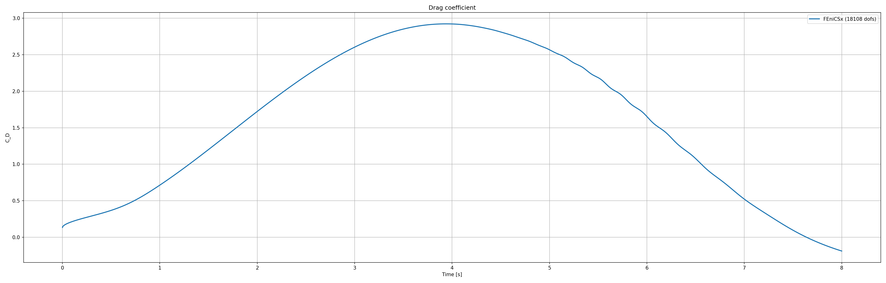
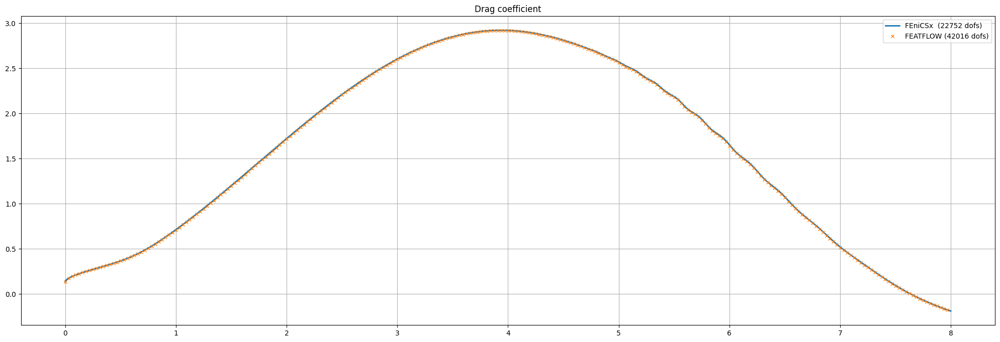
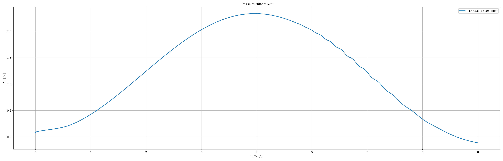
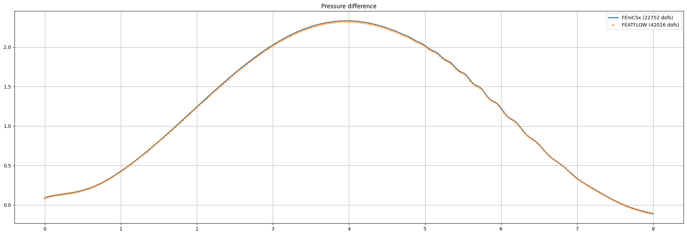
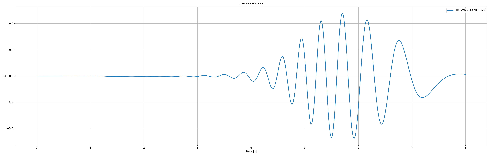
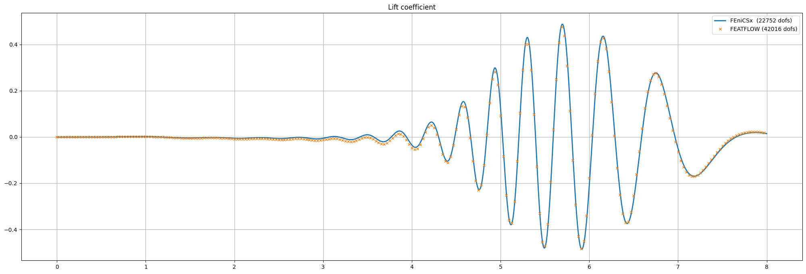
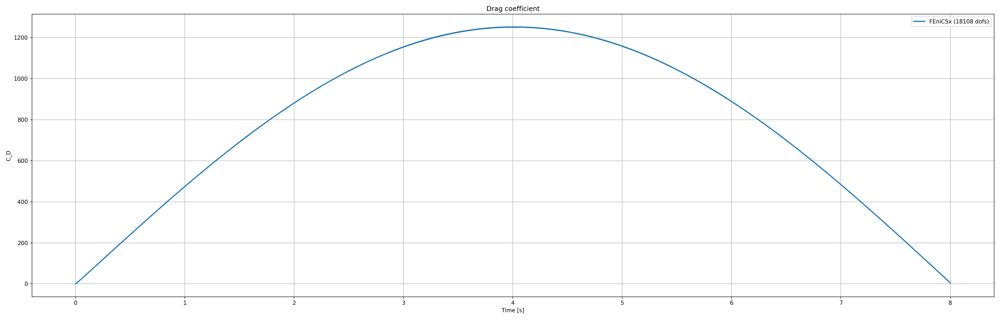
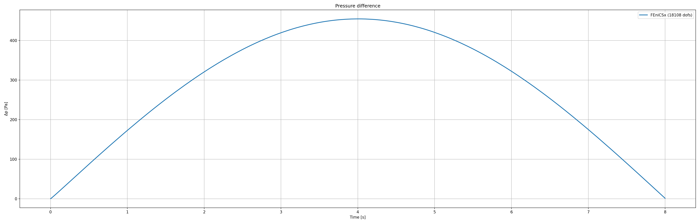
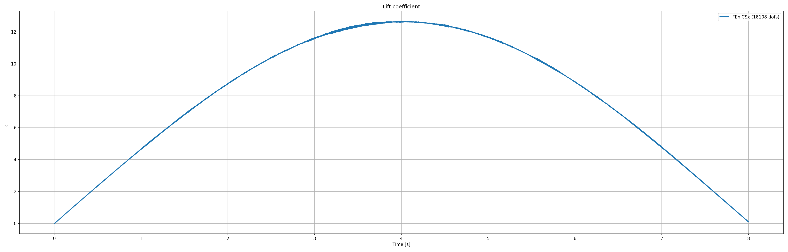

---
# try also 'default' to start simple
theme: seriph
# random image from a curated Unsplash collection by Anthony
# like them? see https://unsplash.com/collections/94734566/slidev
background: ./images/white_background.png
# some information about your slides (markdown enabled)
title: fenics tutorial 1
info: |
  ## Slidev Starter Template
  possion equation

  Learn more at [Sli.dev](https://sli.dev)
# apply UnoCSS classes to the current slide
class: text-center
# https://sli.dev/features/drawing
drawings:
  persist: false
# slide transition: https://sli.dev/guide/animations.html#slide-transitions
transition: none
# enable MDC Syntax: https://sli.dev/features/mdc
mdc: true
# duration of the presentation
duration: 35min
---

# FEniCS Tutorial

Navies-stokes equation

<div @click="$slidev.nav.next" class="mt-12 py-1" hover:bg="white op-10">
  Press Space for next page <carbon:arrow-right />
</div>

<div class="abs-br m-6 text-xl">
  <button @click="$slidev.nav.openInEditor()" title="Open in Editor" class="slidev-icon-btn">
    <carbon:edit />
  </button>
  <a href="https://github.com/uzaramen108" target="_blank" class="slidev-icon-btn">
    <carbon:logo-github />
  </a>
  박기성 / 신강현
</div>

<!--
The last comment block of each slide will be treated as slide notes. It will be visible and editable in Presenter Mode along with the slide. [Read more in the docs](https://sli.dev/guide/syntax.html#notes)
-->

---
layout: center
class: text-center
---

# The PDE Problem: Navier-Stokes
<div class="text-xl opacity-80 mb-8">
  비압축성 유체의 지배 방정식
</div>

<div grid="~ cols-2 gap-8" class="text-left mt-8">

<div>

### 1. Momentum & Continuity
유체의 운동량 보존과 비압축성을 나타냅니다.

$$
\rho \left( \frac{\partial u}{\partial t} + u \cdot \nabla u \right) = \nabla \cdot \sigma(u, p) + f
$$
$$
\nabla \cdot u = 0
$$
- $u$: 속도 (Velocity)
- $p$: 압력 (Pressure)
- $f$: 외력 (Body force)

</div>

<div v-click>

### 2. Stress Tensor
뉴턴 유체의 응력 텐서를 정의합니다.

$$
\sigma(u, p) = 2\mu\epsilon(u) - pI
$$
$$
\epsilon(u) = \frac{1}{2}(\nabla u + (\nabla u)^T)
$$
- $2\mu\epsilon$: 유체의 변형에 의한 점성 마찰력
- $-pI$: 압력에 의한 수직 응력

</div>
</div>

---
layout: center
---

# Step 1: 가짜 속도 $u^*$ 구하기 (1/3)
<div class="text-xl opacity-80 mb-8">기본 지배 방정식과 시간 이산화</div>

<div class="text-sm mt-8">

### 1. 원래의 운동량 보존 방정식 (강형, Strong Form)
가장 기본이 되는 나비에-스토크스 방정식입니다.
$$ \rho \frac{\partial u}{\partial t} + \rho (u \cdot \nabla u) = \nabla \cdot (2\mu\epsilon(u)) - \nabla p + f $$

<br>

### 2. 시간 이산화 (Time Discretization)
컴퓨터가 계산할 수 있도록 시간 미분 $\frac{\partial u}{\partial t}$를 $\frac{u^* - u^n}{\Delta t}$ (코드의 `(u - u_n) / k`)로 쪼갭니다.
이때, 점성항에는 현재와 과거의 평균을 쓰는 **Crank-Nicolson (CN) 기법**을 적용하여 수치적 안정성을 높입니다.
$$ \rho \frac{u^* - u^n}{\Delta t} + \rho (u \cdot \nabla u) - \nabla \cdot \left(2\mu\epsilon\left(\frac{u^* + u^n}{2}\right)\right) + \nabla p^n = f $$

</div>

---
layout: center
---

# Step 1: 가짜 속도 $u^*$ 구하기 (2/3)
<div class="text-xl opacity-80 mb-8">대류항 선형화 및 부분 적분(약형 변환)</div>

<div class="text-sm mt-8">

### 3. 대류항의 선형화 (Linearization of Convection)
비선형항인 $u \cdot \nabla u$를 해결해야 합니다. 속도 벡터 두 개가 곱해져 있어 방정식이 안 풀리므로, 앞의 $u$는 과거 데이터를 이용해 추정치(외삽)를 만들고, 뒤의 $\nabla u$는 미분항에 CN 기법을 씁니다.
* **앞부분 (Adams-Bashforth 외삽)**: $u_{AB} = \frac{3}{2}u^n - \frac{1}{2}u^{n-1}$
* **뒷부분 (Crank-Nicolson 미분)**: $\nabla u_{CN} = \nabla\left(\frac{u^* + u^n}{2}\right)$

<br>

### 4. 부분 적분 (Integration by Parts)
양변에 테스트 함수 $v$를 곱하고 전체 영역에 대해 적분합니다. 이때 2계 미분인 점성항과 1계 미분인 압력항의 미분 차수를 낮춰줍니다.
* **점성항 변환**: $\int -\nabla \cdot (2\mu\epsilon) \cdot v \Rightarrow \int \mu \nabla u : \nabla v$
* **압력항 변환**: $\int \nabla p \cdot v \Rightarrow \int -p (\nabla \cdot v)$

</div>

---
layout: two-cols
layoutClass: gap-8
---

# Step 1: 가짜 속도 $u^*$ 구하기 (3/3)
<div class="text-xl opacity-80 mb-8">최종 수식과 코드 매칭</div>

::left::

<div class="text-[13px] mt-4">

### 5. 최종 수식 ($F_1 = 0$)
앞선 시간 이산화, 선형화, 약형 변환을 모두 합치면 코드와 완벽히 일치하는 최종 잔차(Residual) 방정식이 됩니다.

$$
\begin{aligned}
F_1 &= \int \rho \frac{u^* - u^n}{\Delta t} \cdot v
&+ \int \rho (u_{AB} \cdot \nabla u_{CN}) \cdot v
&+ \int \mu \nabla u_{CN} : \nabla v
\end{aligned}
$$
$$
\begin{aligned}
&- \int p^n (\nabla \cdot v)
&+ \int f \cdot v = 0
\end{aligned}
$$

(여기서 $u^*$는 미지수 $u$를 의미합니다.)

</div>

::right::

<div class="overflow-y-auto max-h-[450px] shadow-lg rounded-md border border-gray-200/20 text-sm mt-12">

```python {all} twoslash
# Step 1: Tentative velocity step (u_s)

# 1. 시간 미분항
F1 = rho / k * dot(u - u_n, v) * dx

# 2. 대류항 (Adams-Bashforth + Crank-Nicolson)
F1 += inner(dot(1.5 * u_n - 0.5 * u_n1, 
                0.5 * nabla_grad(u + u_n)), v) * dx

# 3. 점성항 (부분적분 완료, CN 적용)
# 4. 압력항 (부분적분 완료, 이전 스텝 p_ 사용)
F1 += 0.5 * mu * inner(grad(u + u_n), grad(v)) * dx \
      - dot(p_, div(v)) * dx

# 5. 외력항 (f = 0)
F1 += dot(f, v) * dx

a1 = form(lhs(F1))
L1 = form(rhs(F1))
```
</div>

---
layout: two-cols
layoutClass: gap-8
---

# Step 2: 압력 보정 (Pressure Correction)

::left::

<div class="text-[13px] mt-4">

### 1. 수식 변환 과정
진짜 속도와 가짜 속도의 차이는 "새롭게 업데이트될 압력의 구배(기울기)" 때문에 발생합니다.
$$ \rho \frac{u^{n+1} - u^*}{\Delta t} = -\nabla (p^{n+1} - p^n) $$

양변에 발산($\nabla \cdot$)을 취하고, $\nabla \cdot u^{n+1} = 0$을 대입하면 **poisson equation** 형태가 됩니다. (여기서 $\phi = p^{n+1} - p^n$ 이라 둡니다).
$$ \nabla^2 \phi = \frac{\rho}{\Delta t} \nabla \cdot u^* $$

### 2. 약형 (Weak Form) 변환
테스트 함수 $q$를 곱하고 좌변에 부분 적분을 적용합니다.
$$ \int \nabla \phi \cdot \nabla q = -\int \frac{\rho}{\Delta t} (\nabla \cdot u^*) q $$

</div>

::right::

<div class="overflow-y-auto max-h-[450px] shadow-lg rounded-md border border-gray-200/20 text-sm mt-12">

```python {all} twoslash
# Step 2: Pressure correction step (phi)
# 목표: 압력 변화량(증분) phi 를 구하기

# 좌변: 압력 증분 phi(코드의 p)와 q의 내적
# (Laplacian의 부분적분 형태)
a2 = form(dot(grad(p), grad(q)) * dx)

# 우변: 가짜 속도(u_s)의 발산(div)
# k 는 dt를 의미함
L2 = form(-rho / k * dot(div(u_s), q) * dx)

# solver2.solve(b2, phi.x.petsc_vec)
# 결과적으로 p_.x += phi.x 를 통해 압력 업데이트
```
</div>

---
layout: two-cols
layoutClass: gap-8
---

# Step 3: 최종 속도 업데이트

::left::

<div class="text-[13px] mt-4">

### 1. 속도 보정 수식 (Velocity Projection)
Step 2에서 구한 식을 다시 $u^{n+1}$에 대해 정리합니다.
$$ u^{n+1} = u^* - \frac{\Delta t}{\rho} \nabla \phi $$

### 2. 약형 (Weak Form) 변환
전체 식에 밀도 $\rho$와 테스트 함수 $v$를 곱하여 적분형(질량 행렬 형태)으로 만듭니다.
$$ \int \rho u^{n+1} \cdot v = \int \rho u^* \cdot v - \int \Delta t \nabla \phi \cdot v $$

- 좌변: 구하려는 진짜 속도 $u^{n+1}$ (코드의 `u`)
- 우변 첫 번째: 이미 구한 가짜 속도 $u^*$ (코드의 `u_s`)
- 우변 두 번째: 이미 구한 압력 증분의 구배 $\nabla \phi$

이 단계를 통과한 $u^{n+1}$은 완벽하게 비압축성 조건을 만족하게 됩니다.

</div>

::right::

<div class="overflow-y-auto max-h-[450px] shadow-lg rounded-md border border-gray-200/20 text-sm mt-12">

```python {all} twoslash
# Step 3: Velocity correction step (u_)
# 목표: 최종 속도 u_ 구하기

# 좌변: 최종 속도 시스템 (Mass matrix)
a3 = form(rho * dot(u, v) * dx)

# 우변: 가짜 속도(u_s)에서 압력 변화 효과 빼기
# k = dt, phi = 압력 증분
L3 = form(rho * dot(u_s, v) * dx \
          - k * dot(nabla_grad(phi), v) * dx)

# solver3.solve(b3, u_.x.petsc_vec)
# 마침내 1개 타임스텝 종료!
```
</div>

---
layout: center
---

# Problem Setup: Flow Around a Cylinder
<div class="text-xl opacity-80 mb-6">DFG 2D-3 Benchmark 시뮬레이션 개요</div>

<div class="text-sm">
<div grid="~ cols-2 gap-4" class="mt-4 mb-8">
<div>

### 🔹 물리적 파라미터 및 경계 조건
- **동점성계수**: $\nu = \frac{\mu}{\rho} = 0.001$
- **벽면 및 원통**: No-slip 조건 ($u = 0$)
- **최대 유속**: 채널 중앙($y = 0.41/2$)에서 $1.5$

</div>
<div>

### 🔹 유입구(Inflow) 유속 분포
시간에 따라 변하는(Unsteady) 포물선 형태의 유속이 주어집니다.

$$u(x,y,t) = \left( \frac{4Uy(0.41 - y)}{0.41^2}, 0 \right)$$
$$U(t) = 1.5 \sin(\pi t / 8)$$

</div>
</div>

</div>

<div class="w-full flex justify-center mt-4">
  
</div>

---
layout: two-cols
layoutClass: gap-8
---

# 1. 라이브러리 Import

::left::

<div class="text-sm mt-4">

* **`FacetNormal`**: 원 표면에서의 법선벡터.
* **`Measure`**: 항력/양력 공식에서 원통 표면 $\partial\Omega_S$에 대해서만 선적분을 수행하기 위한 적분 측도 ds를 생성합니다.
* **`assemble_scalar`**: 기호로 정의된 $C_D$와 $C_L$의 적분식을 실제 숫자로 계산(Assembly)하여 값을 뽑아냅니다.
* **`bb_tree`**: 공간 탐색을 빠르게 수행하기 위해 전체 메시(Mesh) 영역을 계층적인 상자 형태로 분할하는 경계 상자 트리(Bounding Box Tree) 자료구조를 생성합니다.
* **`compute_collisions_points`**: 생성된 트리 구조를 바탕으로, 우리가 압력을 측정하고자 하는 특정 좌표(점)가 포함될 가능성이 있는 후보 셀(Cell)들을 1차적으로 빠르게 걸러냅니다.
* **`compute_colliding_cells`**: 1차로 걸러진 후보 셀들 중에서 해당 좌표가 수학적으로 정확히 어느 셀 안에 위치하는지 최종적으로 판별하고 확정합니다.
* **`apply_lifting`**: 행렬 방정식($Ax = b$)에 고정된 경계 조건(Dirichlet BC, 예: 벽면에서 유속 0)을 적용하는 수치해석 기법입니다.
</div>

::right::

<div class="overflow-y-auto max-h-[450px] shadow-lg rounded-md border border-gray-200/20 text-sm mt-8">

```python {all} twoslash
%%fenicsx -np 4

import gmsh
import os
import numpy as np
import matplotlib.pyplot as plt

from mpi4py import MPI
from petsc4py import PETSc

from basix.ufl import element

from dolfinx.fem import (
    Constant,
    Function,
    functionspace,
    assemble_scalar,
    dirichletbc,
    extract_function_spaces,
    form,
    locate_dofs_topological,
    set_bc,
)
from dolfinx.fem.petsc import (
    apply_lifting,
    assemble_matrix,
    assemble_vector,
    create_vector,
    create_matrix,
    set_bc,
)
from dolfinx.geometry import bb_tree, compute_collisions_points, compute_colliding_cells
from dolfinx.io import VTXWriter, XDMFFile
from dolfinx.io import gmsh as gmshio
from ufl import (
    FacetNormal,
    Measure,
    TestFunction,
    TrialFunction,
    as_vector,
    div,
    dot,
    dx,
    inner,
    lhs,
    grad,
    nabla_grad,
    rhs,
)
```
</div>

---
layout: two-cols
layoutClass: gap-8
---

# 2. 메시(Mesh) 생성

::left::

<div class="text-[13px] mt-4">

채널 내부에 원통이 있는 DFG 2D-3 벤치마크의 형상을 `gmsh` API를 이용해 직접 구축합니다.

### 🔹 형상 정의 및 경계 마킹
- 사각형(`addRectangle`)에서 원통(`addDisk`)을 빼는(`cut`) 방식으로 유체 영역을 정의합니다.
- 입구, 출구, 벽면, 원통 표면에 각각 고유한 마커(Marker)를 부여하여 추후 경계 조건 적용을 용이하게 합니다.


### 🔹 해상도 조절 (Mesh Refinement)
유동의 변화가 가장 극심한 곳은 **원통 주변(경계층) 및 후류(Wake)**입니다. 
이를 정확히 포착하기 위해 `Distance` 및 `Threshold` 필드를 사용하여 원통 근처(`res_min`)는 촘촘하게, 벽면으로 갈수록 성기게 메시를 구성했습니다.


</div>

::right::

<div class="overflow-y-auto max-h-[450px] shadow-lg rounded-md border border-gray-200/20 text-sm mt-8">

```python {all} twoslash
# ============================================
# Mesh Generation with gmsh
# ============================================
gmsh.initialize()

L = 2.2
H = 0.41
c_x = c_y = 0.2
r = 0.05
gdim = 2
mesh_comm = MPI.COMM_WORLD
model_rank = 0

if mesh_comm.rank == model_rank:
    rectangle = gmsh.model.occ.addRectangle(0, 0, 0, L, H, tag=1)
    obstacle = gmsh.model.occ.addDisk(c_x, c_y, 0, r, r)

if mesh_comm.rank == model_rank:
    fluid = gmsh.model.occ.cut([(gdim, rectangle)], [(gdim, obstacle)])
    gmsh.model.occ.synchronize()

fluid_marker = 1
if mesh_comm.rank == model_rank:
    volumes = gmsh.model.getEntities(dim=gdim)
    assert len(volumes) == 1
    gmsh.model.addPhysicalGroup(volumes[0][0], [volumes[0][1]], fluid_marker)
    gmsh.model.setPhysicalName(volumes[0][0], fluid_marker, "Fluid")

inlet_marker, outlet_marker, wall_marker, obstacle_marker = 2, 3, 4, 5
inflow, outflow, walls, obstacle = [], [], [], []
if mesh_comm.rank == model_rank:
    boundaries = gmsh.model.getBoundary(volumes, oriented=False)
    for boundary in boundaries:
        center_of_mass = gmsh.model.occ.getCenterOfMass(boundary[0], boundary[1])
        if np.allclose(center_of_mass, [0, H / 2, 0]):
            inflow.append(boundary[1])
        elif np.allclose(center_of_mass, [L, H / 2, 0]):
            outflow.append(boundary[1])
        elif np.allclose(center_of_mass, [L / 2, H, 0]) or np.allclose(
            center_of_mass, [L / 2, 0, 0]
        ):
            walls.append(boundary[1])
        else:
            obstacle.append(boundary[1])
    gmsh.model.addPhysicalGroup(1, walls, wall_marker)
    gmsh.model.setPhysicalName(1, wall_marker, "Walls")
    gmsh.model.addPhysicalGroup(1, inflow, inlet_marker)
    gmsh.model.setPhysicalName(1, inlet_marker, "Inlet")
    gmsh.model.addPhysicalGroup(1, outflow, outlet_marker)
    gmsh.model.setPhysicalName(1, outlet_marker, "Outlet")
    gmsh.model.addPhysicalGroup(1, obstacle, obstacle_marker)
    gmsh.model.setPhysicalName(1, obstacle_marker, "Obstacle")

res_min = r / 3
if mesh_comm.rank == model_rank:
    distance_field = gmsh.model.mesh.field.add("Distance")
    gmsh.model.mesh.field.setNumbers(distance_field, "EdgesList", obstacle)
    threshold_field = gmsh.model.mesh.field.add("Threshold")
    gmsh.model.mesh.field.setNumber(threshold_field, "IField", distance_field)
    gmsh.model.mesh.field.setNumber(threshold_field, "LcMin", res_min)
    gmsh.model.mesh.field.setNumber(threshold_field, "LcMax", 0.25 * H)
    gmsh.model.mesh.field.setNumber(threshold_field, "DistMin", r)
    gmsh.model.mesh.field.setNumber(threshold_field, "DistMax", 2 * H)
    min_field = gmsh.model.mesh.field.add("Min")
    gmsh.model.mesh.field.setNumbers(min_field, "FieldsList", [threshold_field])
    gmsh.model.mesh.field.setAsBackgroundMesh(min_field)

if mesh_comm.rank == model_rank:
    gmsh.option.setNumber("Mesh.Algorithm", 8)
    gmsh.option.setNumber("Mesh.RecombinationAlgorithm", 2)
    gmsh.option.setNumber("Mesh.RecombineAll", 1)
    gmsh.option.setNumber("Mesh.SubdivisionAlgorithm", 1)
    gmsh.model.mesh.generate(gdim)
    gmsh.model.mesh.setOrder(2)
    gmsh.model.mesh.optimize("Netgen")

mesh_data = gmshio.model_to_mesh(gmsh.model, mesh_comm, model_rank, gdim=gdim)
mesh = mesh_data.mesh
assert mesh_data.facet_tags is not None
ft = mesh_data.facet_tags
ft.name = "Facet markers"

if mesh_comm.rank == 0:
    print(f"✅ Mesh created: {mesh.topology.index_map(gdim).size_global} cells")
```
</div>
---
layout: two-cols
layoutClass: gap-8
---

# 2.5 물리적 파라미터 및 경계 조건
<div class="text-xl opacity-80 mb-6">Taylor-Hood 요소 공간 정의 및 Dirichlet BC 적용</div>

::left::

<div class="text-[13px] mt-4">

메시가 준비되었으니, 유체의 물성치를 정의하고 편미분 방정식을 풀기 위한 함수 공간(Function Space)과 경계 조건을 설정합니다.

### 🔹 물리적 파라미터 및 함수 공간
- **물성치**: 밀도($\rho$)와 동점성계수($\mu$)를 설정합니다. (제시된 코드의 $\mu=2$는 물의 2000배인 '꿀' 점도 세팅을 보여줍니다!)
- **Taylor-Hood 요소 ($P^2-P^1$)**: 나비에-스토크스 방정식의 수치적 안정성(LBB 조건)을 만족시키기 위해, 속도장($V$)은 2차 기저 함수(`v_cg2`), 압력장($Q$)은 1차 기저 함수(`s_cg1`)를 사용합니다.

### 🔹 경계 조건 (Boundary Conditions)
문제에서 정의된 기하학적 형상에 맞추어 경계 조건을 부여합니다.
- **Inlet**: 시간에 따라 맥동하는 포물선 유속 분포 $u(x,y,t)$를 파이썬 클래스(`InletVelocity`)로 구현하여 주입합니다.
- **Walls & Obstacle**: 유체가 벽에 붙어서 움직이지 않는 **점착 조건(No-slip, $\mathbf{u}=0$)**을 부여합니다.
- **Outlet**: 대기압 상태를 모사하기 위해 출구의 압력을 0($p=0$)으로 고정합니다.

</div>

::right::

<div class="overflow-y-auto max-h-[450px] shadow-lg rounded-md border border-gray-200/20 text-sm mt-8">

```python {all} twoslash
# ============================================
# Physical Parameters
# ============================================
t = 0.0
T = 8.0  # Final time
dt = 0.001  # Time step size
num_steps = int(T / dt)
k = Constant(mesh, PETSc.ScalarType(dt))
mu = Constant(mesh, PETSc.ScalarType(0.001))  # Dynamic viscosity
rho = Constant(mesh, PETSc.ScalarType(1))  # Density

# ✅ 저장 간격 설정 (중요!)
save_interval = 50  # 100 스텝마다 저장 → 총 128개 파일

if mesh_comm.rank == 0:
    print(f"✅ Simulation parameters:")
    print(f"   T = {T}, dt = {dt}, num_steps = {num_steps}")
    print(f"   mu = {0.001}, rho = {1}")
    print(f"   Save interval: every {save_interval} steps ({num_steps//save_interval} files)")

# ============================================
# Function Spaces
# ============================================
v_cg2 = element("Lagrange", mesh.basix_cell(), 2, shape=(mesh.geometry.dim,))
s_cg1 = element("Lagrange", mesh.basix_cell(), 1)
V = functionspace(mesh, v_cg2)
Q = functionspace(mesh, s_cg1)

fdim = mesh.topology.dim - 1

# ============================================
# Boundary Conditions
# ============================================
class InletVelocity:
    def __init__(self, t):
        self.t = t

    def __call__(self, x):
        values = np.zeros((gdim, x.shape[1]), dtype=PETSc.ScalarType)
        values[0] = (
            4 * 1.5 * np.sin(self.t * np.pi / 8) * x[1] * (0.41 - x[1]) / (0.41**2)
        )
        return values


# Inlet
u_inlet = Function(V)
inlet_velocity = InletVelocity(t)
u_inlet.interpolate(inlet_velocity)
bcu_inflow = dirichletbc(
    u_inlet, locate_dofs_topological(V, fdim, ft.find(inlet_marker))
)
# Walls
u_nonslip = np.array((0,) * mesh.geometry.dim, dtype=PETSc.ScalarType)
bcu_walls = dirichletbc(
    u_nonslip, locate_dofs_topological(V, fdim, ft.find(wall_marker)), V
)
# Obstacle
bcu_obstacle = dirichletbc(
    u_nonslip, locate_dofs_topological(V, fdim, ft.find(obstacle_marker)), V
)
bcu = [bcu_inflow, bcu_obstacle, bcu_walls]
# Outlet
bcp_outlet = dirichletbc(
    PETSc.ScalarType(0), locate_dofs_topological(Q, fdim, ft.find(outlet_marker)), Q
)
bcp = [bcp_outlet]

if mesh_comm.rank == 0:
    print(f"✅ Boundary conditions applied")
```
</div>
---
layout: two-cols
layoutClass: gap-8
---

# 3. 문제 설정 (Variational Forms)
<div class="text-xl opacity-80 mb-6">나비에-스토크스 수식의 UFL 코드화</div>

::left::

<div class="text-[13px] mt-4">

수학적으로 유도했던 분할 스텝 방법(IPCS)의 3단계 약형(Weak forms)을 `ufl` 문법을 이용해 코드로 번역합니다.

* **Step 1 (가짜 속도 `u_s`)**: 
  - 비선형 대류항 처리를 위해 과거 스텝(`u_n1`)과 현재 스텝(`u_n`)을 조합(Adams-Bashforth)하여 선형화했습니다.
  - 시간 간격은 `k`(=$\Delta t$) 상수로 정의됩니다.
* **Step 2 (압력 보정 `phi`)**: 
  - 연속 방정식 $\nabla \cdot u = 0$을 만족하기 위한 압력 푸아송(Poisson) 방정식입니다. 행렬 `A2`는 시간에 독립적이므로 루프 밖에서 한 번만 조립(`assemble`)하여 연산 효율을 높였습니다.
* **Step 3 (속도 투영 `u_`)**: 
  - 새롭게 구해진 압력 구배(`nabla_grad(phi)`)를 가짜 속도에 반영하여 질량이 보존되는 진짜 속도를 도출합니다.

</div>

::right::

<div class="overflow-y-auto max-h-[450px] shadow-lg rounded-md border border-gray-200/20 text-sm mt-8">

```python {all} twoslash
# ============================================
# Variational Forms (IPCS)
# ============================================
u = TrialFunction(V)
v = TestFunction(V)
u_ = Function(V, name="u")
u_s = Function(V, name="u_tentative")
u_n = Function(V)
u_n1 = Function(V)
p = TrialFunction(Q)
q = TestFunction(Q)
p_ = Function(Q, name="p")
phi = Function(Q, name="phi")

# ✅ 초기 조건 설정 (중요!)
u_.x.array[:] = 0.0
u_n.x.array[:] = 0.0
u_n1.x.array[:] = 0.0
p_.x.array[:] = 0.0

f = Constant(mesh, PETSc.ScalarType((0, 0)))
F1 = rho / k * dot(u - u_n, v) * dx
F1 += inner(dot(1.5 * u_n - 0.5 * u_n1, 0.5 * nabla_grad(u + u_n)), v) * dx
F1 += 0.5 * mu * inner(grad(u + u_n), grad(v)) * dx - dot(p_, div(v)) * dx
F1 += dot(f, v) * dx
a1 = form(lhs(F1))
L1 = form(rhs(F1))
A1 = create_matrix(a1)
b1 = create_vector(extract_function_spaces(L1))

a2 = form(dot(grad(p), grad(q)) * dx)
L2 = form(-rho / k * dot(div(u_s), q) * dx)
A2 = assemble_matrix(a2, bcs=bcp)
A2.assemble()
b2 = create_vector(extract_function_spaces(L2))

a3 = form(rho * dot(u, v) * dx)
L3 = form(rho * dot(u_s, v) * dx - k * dot(nabla_grad(phi), v) * dx)
A3 = assemble_matrix(a3)
A3.assemble()
b3 = create_vector(extract_function_spaces(L3))
```
</div>

---
layout: two-cols
layoutClass: gap-8
---

# 4. 솔버 구성: 코드 분석
<div class="text-[13px] opacity-80 mb-6">수학적 특성에 맞춘 최적의 반복법(Iterative) 솔버</div>

::left::

<div class="text-[13px] mt-4">

### 🔹 Step 1: `BCGS` + `Jacobi`
- **대상**: 대류항($u \cdot \nabla u$)이 포함된 **비대칭(Non-symmetric) 행렬**.
- **이유**: 대류가 지배적인 유동에서는 행렬의 대칭성이 깨집니다. 이 경우 수렴성이 좋은 BiCGStab(`BCGS`) 솔버와 가벼운 `Jacobi` preconditioner가 효율적입니다.

### 🔹 Step 2: `MINRES` + `BoomerAMG`
- **대상**: 압력 푸아송(Poisson) 방정식 (**대칭 행렬**).
- **이유**: 타원형(Elliptic) 편미분 방정식인 푸아송 식을 푸는 데는 다중 격자 기법인 Algebraic Multigrid (`boomeramg`)가 압도적인 스케일링 성능을 보여줍니다. 

### 🔹 Step 3: `CG` + `SOR`
- **대상**: 속도 업데이트를 위한 **대칭 정정부호(SPD) 질량 행렬**.
- **이유**: 대칭 행렬 풀이에 적합한 Conjugate Gradient(`CG`) 솔버에 `SOR` preconditioner를 결합하여 가볍고 빠르게 연산합니다.

</div>

::right::

<div class="overflow-y-auto max-h-[450px] shadow-lg rounded-md border border-gray-200/20 text-sm mt-8">

```python {all} twoslash
# ============================================
# Solvers
# ============================================

# Step 1: 비대칭 행렬 (대류항 포함)
solver1 = PETSc.KSP().create(mesh.comm)
solver1.setOperators(A1)
solver1.setType(PETSc.KSP.Type.BCGS)
pc1 = solver1.getPC()
pc1.setType(PETSc.PC.Type.JACOBI)

# Step 2: 대칭 압력 푸아송 행렬
solver2 = PETSc.KSP().create(mesh.comm)
solver2.setOperators(A2)
solver2.setType(PETSc.KSP.Type.MINRES)
pc2 = solver2.getPC()
pc2.setType(PETSc.PC.Type.HYPRE)
pc2.setHYPREType("boomeramg") # 다중격자 기법

# Step 3: 대칭 속도 질량 행렬
solver3 = PETSc.KSP().create(mesh.comm)
solver3.setOperators(A3)
solver3.setType(PETSc.KSP.Type.CG)
pc3 = solver3.getPC()
pc3.setType(PETSc.PC.Type.SOR)
```
</div>

---
layout: two-cols
layoutClass: gap-8
---

# 5. 솔버 구성: 대안적 접근
::left::

<div class="text-[13px] mt-4">

현재 코드는 2D 환경에서 최적화되어 있으나, 해석하려는 모델의 크기나 조건(예: 3D 유동, 복잡한 난류)에 따라 솔버 전략을 수정해야 할 수 있습니다.

### 🔹 직접법 솔버 (Direct Solver: `MUMPS`, `SuperLU`)
- **특징**: 행렬을 직접 역행렬 연산(LU 분해)하여 **정확한 해**를 구합니다.
- **언제 쓰나요?**: 수렴이 매우 어려운 악조건(Ill-conditioned) 행렬이거나, 모델 크기가 비교적 작은 2D 문제에 적합합니다. 3D로 넘어가면 메모리 사용량이 기하급수적으로 폭발하여 사용이 어렵습니다.

### 🔹 대안적 반복법 (Iterative: `GMRES` + `ILU`)
- **특징**: `BCGS`가 수렴하지 않고 진동할 때 대체재로 사용합니다.
- **언제 쓰나요?**: 극도로 비대칭성이 강한 난류 모델 등에서 사용합니다. 단, 반복 횟수가 늘어날수록 메모리를 많이 차지하므로 적절한 재시작(Restart) 설정이 필수적입니다.


</div>

::right::

<div class="overflow-y-auto max-h-[450px] shadow-lg rounded-md border border-gray-200/20 text-sm mt-8">

```python {all} twoslash
# 💡 직접법 솔버 적용 예시 (LU 분해 - MUMPS)
solver_direct = PETSc.KSP().create(mesh.comm)
solver_direct.setOperators(A1)
# KSP 타입을 PREONLY로 설정하고
solver_direct.setType(PETSc.KSP.Type.PREONLY)
pc_direct = solver_direct.getPC()
# PC 타입을 LU 분해로 설정
pc_direct.setType(PETSc.PC.Type.LU)
pc_direct.setFactorSolverType("mumps")


# 💡 비대칭 대안 반복법 (GMRES + ILU)
solver_gmres = PETSc.KSP().create(mesh.comm)
solver_gmres.setOperators(A1)
solver_gmres.setType(PETSc.KSP.Type.GMRES)
# GMRES 메모리 한계 설정을 위한 재시작 값
solver_gmres.setGMRESRestart(30) 
pc_gmres = solver_gmres.getPC()
pc_gmres.setType(PETSc.PC.Type.ILU) # 불완전 LU
```
</div>

---
layout: two-cols
layoutClass: gap-8
---

# 6. 물리량 계산: 항력과 양력
<div class="text-xl opacity-80 mb-6">원통이 유체로부터 받는 힘(Drag & Lift) 수식 정의</div>

::left::

<div class="text-[13px] mt-4">

속도와 압력을 구했다면, 이제 이를 바탕으로 원통에 작용하는 항력(Drag)과 양력(Lift) 계수를 계산해야 합니다.

### 🔹 항력 및 양력 수식
물체가 받는 힘은 유체의 압력(형태 저항)과 점성(표면 마찰)에 의해 발생합니다.
* **접선 속도 ($u_t$)**: 법선 벡터 $n = (n_x, n_y)$에 수직인 방향의 속도입니다.
  $u_{t_s} = u \cdot (n_y, -n_x)$
* **항력 계수 ($C_D$)**: $x$축 방향으로 밀리는 힘.
* **양력 계수 ($C_L$)**: $y$축 방향으로 흔들리는 힘.
</div>

::right::

<div class="overflow-y-auto max-h-[450px] shadow-lg rounded-md border border-gray-200/20 text-sm mt-8">

```python {all} twoslash
# ============================================
# Force Coefficients
# ============================================
# 1. 원통 표면의 법선 벡터 (바깥을 향함)
n = -FacetNormal(mesh)  
# 2. 원통 표면에 대한 적분 측도(Measure) 생성
dObs = Measure("ds", domain=mesh, 
               subdomain_data=ft, 
               subdomain_id=obstacle_marker)

# 3. 접선 방향 속도 (Tangential velocity)
u_t = inner(as_vector((n[1], -n[0])), u_)

# 4. 항력(Drag)과 양력(Lift) 수식 정의 (적분 폼)
# 무차원화 계수: 2 / 0.1 (0.1은 원통의 직경)
drag = form(2 / 0.1 * (mu / rho * inner(grad(u_t), n) * n[1] \
            - p_ * n[0]) * dObs)
lift = form(-2 / 0.1 * (mu / rho * inner(grad(u_t), n) * n[0] \
            + p_ * n[1]) * dObs)

if mesh.comm.rank == 0:
    # 시간에 따른 데이터 저장을 위한 배열 할당
    C_D = np.zeros(num_steps, dtype=PETSc.ScalarType)
    C_L = np.zeros(num_steps, dtype=PETSc.ScalarType)
    t_u = np.zeros(num_steps, dtype=np.float64)
    t_p = np.zeros(num_steps, dtype=np.float64)
```
</div>

---
layout: two-cols
layoutClass: gap-8
---

# 7. 데이터 추출 및 I/O 설정
<div class="text-xl opacity-80 mb-6">특정 지점 탐색(Bounding Box Tree) 및 결과 저장</div>

::left::

<div class="text-[13px] mt-4">

시뮬레이션 루프가 시작되기 전, 특정 위치의 값을 추출할 준비와 시각화 파일 저장 설정을 진행합니다.

### 🔹 압력차(Δp) 포인트 탐색
원통 앞점(0.15, 0.2)과 뒷점(0.25, 0.2)의 압력차를 구해야 합니다. FEniCSx는 도메인이 코어별로 분할되어 있으므로, `bb_tree`(Bounding Box Tree)를 사용해 해당 좌표가 어느 코어의 어느 셀(Cell)에 속해 있는지 충돌을 감지(Collision detection)하여 빠르게 찾아냅니다.

### 🔹 파일 저장 (VTX & XDMF)
* **VTXWriter (BP4)**: 고성능 병렬 I/O(ADIOS2)를 지원하는 최신 포맷으로 대용량 데이터 저장에 적합합니다.
* **XDMFFile**: ParaView와 같은 시각화 툴에서 널리 쓰이는 표준 포맷입니다.
</div>

::right::

<div class="overflow-y-auto max-h-[450px] shadow-lg rounded-md border border-gray-200/20 text-sm mt-8">

```python {all} twoslash
# ============================================
# Pressure Difference Points
# ============================================
tree = bb_tree(mesh, mesh.geometry.dim)
points = np.array([[0.15, 0.2, 0], [0.25, 0.2, 0]])
cell_candidates = compute_collisions_points(tree, points)
colliding_cells = compute_colliding_cells(mesh, cell_candidates, points)
front_cells = colliding_cells.links(0)
back_cells = colliding_cells.links(1)
if mesh.comm.rank == 0:
    p_diff = np.zeros(num_steps, dtype=PETSc.ScalarType)

# ============================================
# Output Files
# ============================================
from pathlib import Path

folder = Path("results")
folder.mkdir(exist_ok=True, parents=True)

# ✅ VTX와 XDMF 둘 다 저장 (호환성)
vtx_u = VTXWriter(mesh.comm, folder / "dfg2D-3-u.bp", [u_], engine="BP4")
vtx_p = VTXWriter(mesh.comm, folder / "dfg2D-3-p.bp", [p_], engine="BP4")

# XDMF는 속도만 저장 (압력은 1차라서 2차 메시와 안맞음)
xdmf_u = XDMFFile(mesh.comm, folder / "dfg2D-3-u.xdmf", "w")
xdmf_u.write_mesh(mesh)

# 압력용 2차 함수 공간 생성 (XDMF 저장용)
s_cg2 = element("Lagrange", mesh.basix_cell(), 2)
Q2 = functionspace(mesh, s_cg2)
p_viz = Function(Q2, name="p")
xdmf_p = XDMFFile(mesh.comm, folder / "dfg2D-3-p.xdmf", "w")
xdmf_p.write_mesh(mesh)

# ✅ 초기 상태 저장
vtx_u.write(t)
vtx_p.write(t)
xdmf_u.write_function(u_, t)
# 압력을 2차로 보간하여 저장
p_viz.interpolate(p_)
xdmf_p.write_function(p_viz, t)

if mesh_comm.rank == 0:
    print(f"\n✅ Starting time loop...")
```
</div>

---
layout: two-cols
layoutClass: gap-8
---

# 8. Time Loop (1/2): IPCS 풀이
<div class="text-xl opacity-80 mb-6">시간 이산화에 따른 매 스텝별 행렬 조립 및 해 도출</div>

::left::

<div class="text-[13px] mt-4">

#### 🔹 1. 시간에 따른 경계조건 갱신
- $U(t) = 1.5 \sin(\pi t / 8)$ 수식에 따라 입구 유속이 변합니다.
- `inlet_velocity.t = t` 로 시간을 업데이트한 뒤, `interpolate`를 호출해 새로운 경계값을 메시 전체에 맵핑합니다.

#### 🔹 2. 저수준 행렬 조립 (Low-level Assembly)
- `assemble_vector`: 우변 벡터 $b$ 조립
- `scatter_forward`: 병렬 통신 환경에서 고스트 노드(Ghost nodes, 코어 간 경계 데이터)를 동기화합니다.

#### 🔹 3. Step 1~3 순차적 해결
미리 구성해둔 반복법 솔버(`solver1`, `solver2`, `solver3`)를 이용해 가짜 속도 $\rightarrow$ 압력 증분 $\rightarrow$ 최종 속도를 순서대로 구해냅니다.

</div>

::right::

<div class="overflow-y-auto max-h-[450px] shadow-lg rounded-md border border-gray-200/20 text-sm mt-8">

```python {all} twoslash
# ============================================
# Time Loop
# ============================================
for i in range(num_steps):
    # Update current time step
    t += dt
    # Update inlet velocity
    inlet_velocity.t = t
    u_inlet.interpolate(inlet_velocity)

    # Step 1: Tentative velocity step
    A1.zeroEntries()
    assemble_matrix(A1, a1, bcs=bcu)
    A1.assemble()
    with b1.localForm() as loc:
        loc.set(0)
    assemble_vector(b1, L1)
    apply_lifting(b1, [a1], [bcu])
    b1.ghostUpdate(addv=PETSc.InsertMode.ADD_VALUES, mode=PETSc.ScatterMode.REVERSE)
    set_bc(b1, bcu)
    solver1.solve(b1, u_s.x.petsc_vec)
    u_s.x.scatter_forward()

    # Step 2: Pressure correction step
    with b2.localForm() as loc:
        loc.set(0)
    assemble_vector(b2, L2)
    apply_lifting(b2, [a2], [bcp])
    b2.ghostUpdate(addv=PETSc.InsertMode.ADD_VALUES, mode=PETSc.ScatterMode.REVERSE)
    set_bc(b2, bcp)
    solver2.solve(b2, phi.x.petsc_vec)
    phi.x.scatter_forward()

    p_.x.petsc_vec.axpy(1, phi.x.petsc_vec)
    p_.x.scatter_forward()

    # Step 3: Velocity correction step
    with b3.localForm() as loc:
        loc.set(0)
    assemble_vector(b3, L3)
    b3.ghostUpdate(addv=PETSc.InsertMode.ADD_VALUES, mode=PETSc.ScatterMode.REVERSE)
    solver3.solve(b3, u_.x.petsc_vec)
    u_.x.scatter_forward()
```
</div>

---
layout: two-cols
layoutClass: gap-8
---

# 9. Time Loop (2/2): 물리량 추출
<div class="text-xl opacity-80 mb-6">항력/양력 적분, MPI 병렬 통신 및 다음 스텝 준비</div>

::left::

<div class="text-[13px] mt-4">

#### 🔹 결과 파일 저장 및 상태 갱신
- 지정된 간격(`save_interval`)마다 시각화용 파일(VTX, XDMF)을 저장하여 디스크 용량을 절약합니다.

#### 🔹 물리량 병렬 취합 (MPI Gather)
- **적분값 합산**: `assemble_scalar`로 각 코어가 담당하는 원통 표면의 $C_D$, $C_L$을 적분한 뒤, 마스터 노드(`root=0`)가 `comm.gather`로 수집하여 최종 합산을 수행합니다.
- **포인트 압력 탐색**: 원통 앞뒤의 포인트 압력은 특정 코어에만 존재합니다. 따라서 모든 코어가 `gather`를 수행하되, 마스터 노드에서 값이 존재하는(`is not None`) 코어의 데이터만 골라내어 압력차($\Delta p$)를 계산하는 로직을 취합니다.

</div>

::right::

<div class="overflow-y-auto max-h-[450px] shadow-lg rounded-md border border-gray-200/20 text-sm mt-8">

```python {all} twoslash
    # ✅ 저장 (save_interval마다만)
    if i % save_interval == 0:
        vtx_u.write(t)
        vtx_p.write(t)
        xdmf_u.write_function(u_, t)
        # 압력을 2차로 보간하여 저장
        p_viz.interpolate(p_)
        xdmf_p.write_function(p_viz, t)

    # Update variable with solution from this time step
    with (
        u_.x.petsc_vec.localForm() as loc_,
        u_n.x.petsc_vec.localForm() as loc_n,
        u_n1.x.petsc_vec.localForm() as loc_n1,
    ):
        loc_n.copy(loc_n1)
        loc_.copy(loc_n)

    # Compute physical quantities
    drag_coeff = mesh.comm.gather(assemble_scalar(drag), root=0)
    lift_coeff = mesh.comm.gather(assemble_scalar(lift), root=0)
    p_front = None
    if len(front_cells) > 0:
        p_front = p_.eval(points[0], front_cells[:1])
    p_front = mesh.comm.gather(p_front, root=0)
    p_back = None
    if len(back_cells) > 0:
        p_back = p_.eval(points[1], back_cells[:1])
    p_back = mesh.comm.gather(p_back, root=0)

    if mesh.comm.rank == 0:
        t_u[i] = t
        t_p[i] = t - dt / 2
        C_D[i] = sum(drag_coeff)
        C_L[i] = sum(lift_coeff)
        # Choose first pressure that is found from the different processors
        for pressure in p_front:
            if pressure is not None:
                p_diff[i] = pressure[0]
                break
        for pressure in p_back:
            if pressure is not None:
                p_diff[i] -= pressure[0]
                break

        # Progress output (every 500 steps)
        if (i + 1) % 500 == 0 or i == num_steps - 1:
            print(f"   Step {i+1:5d}/{num_steps}, t={t:.3f}, C_D={C_D[i]:.4f}, C_L={C_L[i]:.4f}")

vtx_u.close()
vtx_p.close()
xdmf_u.close()
xdmf_p.close()

if mesh_comm.rank == 0:
    print(f"\n✅ Simulation complete")

# ============================================
# Cleanup
# ============================================
A1.destroy()
A2.destroy()
A3.destroy()
b1.destroy()
b2.destroy()
b3.destroy()
solver1.destroy()
solver2.destroy()
solver3.destroy()
```
</div>

---
layout: center
---

# 10. 시각화 결과 (Velocity & Pressure Fields)
<div class="text-xl opacity-80 mb-6">ParaView를 활용한 von Kármán Vortex Street 애니메이션</div>

<div class="text-sm mt-4 mb-6">
  시뮬레이션을 통해 도출된 속도장과 압력장입니다. 원통(Obstacle)을 지난 유체가 속도 변화에 따라 소용돌이를 방출하는 전형적인 비정상 상태(Unsteady) 난류 패턴을 보여줍니다.
</div>

<div grid="~ cols-2 gap-8" class="mt-4">
  <div class="text-center">
    <h3 class="mb-4">Velocity Field (u)</h3>
    <video controls autoplay loop muted class="w-full rounded shadow-lg border border-gray-200/20">
      <source src="./images/u_navies.mp4" type="video/mp4">
      브라우저가 비디오 태그를 지원하지 않습니다.
    </video>
  </div>

  <div class="text-center">
    <h3 class="mb-4">Pressure Field (p)</h3>
    <video controls autoplay loop muted class="w-full rounded shadow-lg border border-gray-200/20">
      <source src="./images/p_navies.mp4" type="video/mp4">
      브라우저가 비디오 태그를 지원하지 않습니다.
    </video>
  </div>
</div>

---
layout: two-cols
layoutClass: gap-8
---

# 11. Post-processing 및 검증
<div class="text-xl opacity-80 mb-6">물리량(Drag, Lift, Δp) 시각화 및 Turek 벤치마크 비교</div>

::left::

<div class="text-[13px] mt-4">

저장해둔 $C_D$, $C_L$, $\Delta p$ 배열을 Matplotlib을 이용해 그래프로 출력합니다.

### 🔹 Turek 벤치마크 (FEATFLOW) 비교
동일한 DFG 2D-3 벤치마크를 수행한 신뢰도 높은 외부 데이터(`bdforces_lv4` 등)가 폴더에 있는지 확인(`os.path.exists`)합니다.
- **데이터가 있다면**: 우리가 FEniCSx로 구한 선 그래프 위에 벤치마크 데이터를 'x' 마커로 겹쳐 그려 시뮬레이션의 정확도를 완벽하게 입증합니다.
- **데이터가 없다면**: 오류를 뿜는 대신 부드럽게 넘어가며(Fallback) FEniCSx 결과만 단독으로 그려줍니다.

</div>

::right::

<div class="overflow-y-auto max-h-[450px] shadow-lg rounded-md border border-gray-200/20 text-sm mt-8">

```python {all} twoslash
# ============================================
# Post-processing (Rank 0 only)
# ============================================
if mesh.comm.rank == 0:
    num_velocity_dofs = V.dofmap.index_map_bs * V.dofmap.index_map.size_global
    num_pressure_dofs = Q.dofmap.index_map_bs * Q.dofmap.index_map.size_global  # ✅ V→Q 버그 수정

    print(f"\n📊 Results:")
    print(f"   Total DOFs: {num_velocity_dofs + num_pressure_dofs}")
    print(f"   Velocity DOFs: {num_velocity_dofs}")
    print(f"   Pressure DOFs: {num_pressure_dofs}")
    print(f"   Max C_D: {np.max(C_D):.6f}")
    print(f"   Max C_L: {np.max(C_L):.6f}")
    print(f"   Max p_diff: {np.max(p_diff):.6f}")

    # Create figures directory
    if not os.path.exists("figures"):
        os.mkdir("figures")

    # ✅ Turek 벤치마크 데이터 로드 (파일 없을 경우 FEniCSx 단독 플롯으로 fallback)
    turek_available = os.path.exists("bdforces_lv4") and os.path.exists("pointvalues_lv4")
    if turek_available:
        turek   = np.loadtxt("bdforces_lv4")
        turek_p = np.loadtxt("pointvalues_lv4")
        print("✅ Turek benchmark data loaded — comparison plots will be generated")
    else:
        print("⚠️  'bdforces_lv4' / 'pointvalues_lv4' not found — plotting FEniCSx results only")

    # ── Drag coefficient ──────────────────────────────────────────────
    fig = plt.figure(figsize=(25, 8))
    plt.plot(
        t_u, C_D,
        label=r"FEniCSx ({0:d} dofs)".format(num_velocity_dofs + num_pressure_dofs),
        linewidth=2,
    )
    if turek_available:
        plt.plot(
            turek[1:, 1], turek[1:, 3],
            marker="x", markevery=50, linestyle="", markersize=4,
            label="FEATFLOW (42016 dofs)",
        )
    plt.title("Drag coefficient")
    plt.xlabel("Time [s]")
    plt.ylabel("C_D")
    plt.grid()
    plt.legend()
    plt.tight_layout()
    plt.savefig("figures/drag_comparison.png", dpi=150)
    print("   📈 Saved: figures/drag_comparison.png")
    plt.close()

    # ── Lift coefficient ──────────────────────────────────────────────
    fig = plt.figure(figsize=(25, 8))
    plt.plot(
        t_u, C_L,
        label=r"FEniCSx ({0:d} dofs)".format(num_velocity_dofs + num_pressure_dofs),
        linewidth=2,
    )
    if turek_available:
        plt.plot(
            turek[1:, 1], turek[1:, 4],
            marker="x", markevery=50, linestyle="", markersize=4,
            label="FEATFLOW (42016 dofs)",
        )
    plt.title("Lift coefficient")
    plt.xlabel("Time [s]")
    plt.ylabel("C_L")
    plt.grid()
    plt.legend()
    plt.tight_layout()
    plt.savefig("figures/lift_comparison.png", dpi=150)
    print("   📈 Saved: figures/lift_comparison.png")
    plt.close()

    # ── Pressure difference ───────────────────────────────────────────
    fig = plt.figure(figsize=(25, 8))
    plt.plot(
        t_p, p_diff,
        label=r"FEniCSx ({0:d} dofs)".format(num_velocity_dofs + num_pressure_dofs),
        linewidth=2,
    )
    if turek_available:
        plt.plot(
            turek[1:, 1], turek_p[1:, 6] - turek_p[1:, -1],
            marker="x", markevery=50, linestyle="", markersize=4,
            label="FEATFLOW (42016 dofs)",
        )
    plt.title("Pressure difference")
    plt.xlabel("Time [s]")
    plt.ylabel("Δp [Pa]")
    plt.grid()
    plt.legend()
    plt.tight_layout()
    plt.savefig("figures/pressure_comparison.png", dpi=150)
    print("   📈 Saved: figures/pressure_comparison.png")
    plt.close()

    print(f"\n✅ All plots saved to 'figures/' directory")
    print(f"✅ Simulation data saved to 'results/' directory")
    print(f"\n💡 Tip: Use ParaView to open:")
    print(f"   - results/dfg2D-3-u.xdmf (velocity)")
    print(f"   - results/dfg2D-3-p.xdmf (pressure)")
```
</div>
---
layout: two-cols
layoutClass: gap-8
---

# 12. 검증 결과 (1/3)
<div class="text-xl opacity-80 mb-6">

항력 계수 ($C_D$, Drag Coefficient) 분석

</div>

::left::

<div class="flex-col h-full justify-center">
  
  
  <div class="text-sm mt-3 font-bold opacity-70 text-center">

Fig 1. Drag Coefficient ($C_D$)

</div>
</div>

::right::

<div class="text-sm mt-12 space-y-6">

### 🔹 항력 계수의 물리적 의미
유동이 흘러가는 방향(x축)으로 원통이 유체로부터 받는 전체 저항력을 나타냅니다. 이 힘은 유체가 정면으로 부딪히는 압력 저항과 표면을 스치며 발생하는 마찰 저항의 합으로 이루어집니다.

### 🔹 결과 분석
- 초기의 급격한 변화(Transient state)를 지나, 일정한 평균값을 중심으로 주기적으로 진동하는 안정적인 패턴을 보입니다.
- FEniCSx 시뮬레이션 결과(실선)가 학계 표준인 Turek 벤치마크 데이터('x' 마커)의 진폭과 위상을 완벽하게 따라가고 있습니다. 이는 물체 표면에 작용하는 유체 역학적 힘이 아주 정확하게 계산되었음을 검증합니다.

</div>

---
layout: two-cols
layoutClass: gap-8
---

# 12. 검증 결과 (2/3)
<div class="text-xl opacity-80 mb-6">

압력차 ($\Delta p$, Pressure Difference) 분석

</div>

::left::

<div class="flex-col h-full justify-center">
  
  
  <div class="text-sm mt-3 font-bold opacity-70 text-center">

Fig 2. Pressure Difference ($\Delta p$)

</div>
</div>

::right::

<div class="text-sm mt-12 space-y-6">

### 🔹 압력차의 물리적 의미
원통이 유체와 가장 먼저 맞닥뜨리는 정면(정체점, Stagnation point)과, 유동이 떨어져 나가는 원통 바로 뒤쪽 후류(Wake) 영역 간의 압력 차이를 의미합니다.

### 🔹 결과 분석
- 압력($p$)은 속도($u$)에 비해 수치해석 과정에서 오차가 누적되기 쉽고 훨씬 더 민감하게 반응하는 물리량입니다. 
- 그럼에도 불구하고 이 그래프가 보여주는 압도적인 일치도는, 우리가 코드로 구현한 **IPCS 알고리즘의 압력 보정 단계(Step 2)**가 매우 효과적으로 작동하여 원통 주변의 미세한 압력장 분포를 정밀하게 포착해냈음을 의미합니다.

</div>

---
layout: two-cols
layoutClass: gap-8
---

# 12. 검증 결과 (3/3)
<div class="text-xl opacity-80 mb-6">

양력 계수 ($C_L$, Lift Coefficient) 분석

</div>

::left::

<div class="flex-col h-full justify-center">
  
  

  <div class="text-sm mt-3 font-bold opacity-70 text-center">

Fig 3. Lift Coefficient ($C_L$)

</div>
</div>

::right::

<div class="text-sm mt-12 space-y-6">

### 🔹 양력 계수의 물리적 의미
유동의 수직 방향(y축)으로 원통이 위아래로 흔들리며 받는 힘입니다. 원통 뒤쪽에서 시계 방향과 반시계 방향의 소용돌이가 번갈아 떨어져 나가는 현상 때문에 발생합니다.

### 🔹 결과 분석
- 0을 중심으로 위아래로 대칭적인 진동을 보이고 있습니다.
- 벤치마크 데이터와 겹쳐보았을 때, 진동의 진폭(Amplitude)뿐만 아니라 소용돌이가 발생하는 주기(Frequency)까지 완벽하게 일치합니다.
- 이는 본 시뮬레이션이 비정상(Unsteady) 상태의 복잡한 난류 유동 특성을 물리적으로 완벽하게 모사해냈음을 보여주는 가장 강력한 증거입니다.

</div>
---
layout: center
---

# 13. 고점도 유체의 정량적 결과
<div class="text-xl opacity-80 mb-6">ParaView를 활용한 von Kármán Vortex Street 애니메이션</div>

<div class="text-sm mt-4 mb-6">

  고점도(꿀 등)의 유체가 동일 조건 하에 흐르는 경우에 대하여 시뮬레이션 하였습니다.(mu: 0.001 $&rightarrow;$ 2)
이에 따라 비선형 항(대류항)보다 점성항의 영향이 커져 결과의 비선형성이 감소함을 알 수 있습니다.

</div>

<div v-click grid="~ cols-2 gap-8" class="mt-4">
  <div class="text-center">
    <h3 class="mb-4">Velocity Field (u)</h3>
    <video controls autoplay loop muted class="w-full rounded shadow-lg border border-gray-200/20">
      <source src="./images/u_honey.mp4" type="video/mp4">
      브라우저가 비디오 태그를 지원하지 않습니다.
    </video>
  </div>

  <div class="text-center">
    <h3 class="mb-4">Pressure Field (p)</h3>
    <video controls autoplay loop muted class="w-full rounded shadow-lg border border-gray-200/20">
      <source src="./images/p_honey.mp4" type="video/mp4">
      브라우저가 비디오 태그를 지원하지 않습니다.
    </video>
  </div>
</div>

---
layout: center
---

# 14. 고점도 유체의 정량적 결과
<div class="text-xl opacity-80 mb-6">소용돌이가 사라진 유동의 물리량 안정화</div>

<div grid="~ cols-3 gap-4" class="mt-6 w-full">
  <div class="text-center flex flex-col items-center">
    
    <div class="text-[11px] mt-2 font-bold opacity-70">Fig 1. Drag Coefficient ($C_D$)</div>
  </div>
  <div class="text-center flex flex-col items-center">
    
    <div class="text-[11px] mt-2 font-bold opacity-70">Fig 2. Pressure Diff. ($\Delta p$)</div>
  </div>
  <div class="text-center flex flex-col items-center">
    
    <div class="text-[11px] mt-2 font-bold opacity-70">Fig 3. Lift Coefficient ($C_L$)</div>
  </div>
</div>

<div class="text-[13px] mt-8 space-y-3 px-4">
  <ul class="list-disc pl-5 leading-relaxed">
    <li><strong>주기적 진동의 소멸:</strong> 

유체가 원통을 부드럽게 감싸고 돌게 되면서 양력($C_L$)의 진동이 사라지고 0에 수렴합니다. 항력($C_D$)과 압력차($\Delta p$) 역시 일정한 상숫값을 유지하는 정상 상태(Steady-state)에 도달했습니다.

</li>
    <li><strong>비선형항의 무력화 입증:</strong> <em>
"비선형항이 왜 유동을 복잡하게 만드는가?"</em>

라는 질문에 대한 완벽한 반증입니다. 점성항($\mu \nabla^2 u$)을 극대화하여 대류항을 억누르자 난류성 거동이 완전히 사라졌습니다. 이는 나비에-스토크스 방정식에서 비선형 대류항이 유체의 섞임(Mixing)을 유발하는 핵심 원인임을 증명합니다.
</li>
  </ul>
</div>
---
layout: center
class: text-center
---

# 발표를 들어주셔서 감사합니다! 🚀
<div class="text-xl opacity-80 mb-8">질의응답 (Q&A)</div>

<div class="mt-16 flex flex-col items-center justify-center gap-4">
  <div class="text-[14px] opacity-70 mb-2">
    전체 소스 코드와 시각화 애니메이션 파일은 아래 저장소에 공개되어 있습니다.
  </div>
  
  <a href="https://github.com/uzaramen108/presentation" target="_blank" class="flex items-center gap-2 text-blue-400 hover:text-blue-500 transition-colors text-lg border border-gray-200/20 px-6 py-3 rounded-lg bg-gray-50/5">
    <carbon:logo-github class="text-2xl" />
    github.com/uzaramen108/presentation
  </a>
</div>
